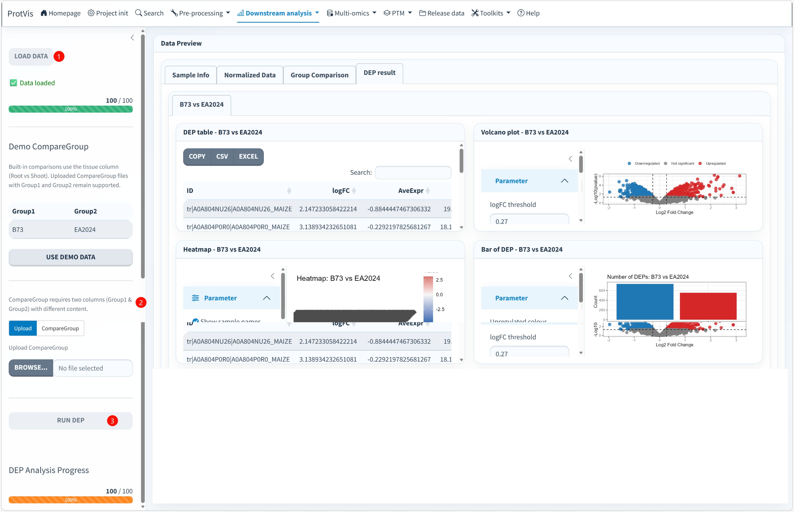

## Statistical model

The current DEP module uses **limma** (`lmFit`, contrasts, `eBayes`, `topTable`) on the normalized protein-abundance matrix. Each row of the comparison table defines a `Group1` versus `Group2` contrast.

## DEP interface

The full-resolution screenshot below shows the current DEP page with an active **B73 vs EA2024** comparison. It includes the data preview, comparison setup, DEP table, volcano plot, heatmap and DEP-count summary in one interface.

{#fig-dep-gui fig-alt="Screenshot of the ProtVis DEP analysis page. The interface contains Load Data, Sample Info, Normalized Data, Group Comparison, a B73 versus EA2024 result table, volcano plot, heatmap, DEP count bar plot, CompareGroup controls and a Run DEP button." width="100%" fig-align="center"}

### Recommended operating order

**1. Load the normalized project data.** Open **Downstream analysis → DEP analysis** and click **LOAD DATA**. Confirm that the status reaches completion, then inspect **Sample Info** and **Normalized Data**. Do not start a contrast until sample identifiers, grouping metadata and the normalized matrix are aligned.

**2. Define the group comparison.** ProtVis accepts a comparison table with exactly two columns, `Group1` and `Group2`. You can use the built-in/demo comparison, edit or paste a comparison table, or upload a `.csv`/`.xlsx` file. In the screenshot, the active contrast is **B73 vs EA2024**. Group labels must exactly match the values used in the relevant `sample_info` grouping field.

A minimal comparison file is:

```text
Group1,Group2
B73,EA2024
```

Multiple rows can be supplied when several contrasts are required. ProtVis processes each valid row and creates a separate result view for each comparison.

**3. Set the significance/display thresholds.** The current volcano controls start with `logFC threshold = 0.27`, corresponding to about a 1.21-fold change on a log2 scale, and `P-value threshold = 0.05`. These controls determine the displayed Upregulated, Downregulated and Not significant classes. Changing the thresholds updates the reactive plots; it does not recompute the underlying limma model.

**4. Click RUN DEP.** Start the analysis only after the comparison table and thresholds are sensible. Follow the **DEP Analysis Progress** indicator until the run completes. Long-running actions are protected against rapid duplicate clicks in the current ProtVis interface.

**5. Inspect the DEP table before the plots.** The result table contains `logFC`, average expression and limma significance statistics. Use the table as the quantitative record and export it with the available copy/CSV/Excel controls when needed.

**6. Interpret the volcano, heatmap and DEP-count plot together.** The volcano plot summarizes effect size and significance, the heatmap shows the abundance pattern of the currently significant protein set, and the DEP-count plot summarizes the number of classified proteins. In the screenshot these views are synchronized for **B73 vs EA2024**.

## Prepare comparisons

ProtVis accepts a comparison table with exactly two columns:

```text
Group1,Group2
Control,Treatment
Root,Shoot
```

The group labels must exactly match values in the relevant `sample_info` grouping column. A mismatch in spelling, capitalization, or whitespace can produce an invalid contrast even when the biological groups are conceptually the same.

The interface also supports built-in/demo comparisons derived from available metadata as well as user-supplied CompareGroup files. Use the comparison source that corresponds to the actual experimental factor being tested.

## Current significance controls

The volcano panel currently starts with:

- `logFC threshold = 0.27` (approximately a 1.21-fold change on a log2 scale);
- `P-value threshold = 0.05`.

The displayed `regulation` classification uses `logFC` together with the raw limma `P.Value`. The limma result table also contains multiple-testing-adjusted statistics.

::: {.callout-important}
## Use adjusted p-values for publication-grade FDR control
If the analysis plan requires FDR control, base final biological claims and downstream ID lists on the adjusted p-value column, such as `adj.P.Val`, rather than assuming the volcano panel's raw `P.Value` cutoff is an FDR threshold. Record both the effect-size and significance thresholds used in the manuscript Methods.
:::

## Dynamic plots

Volcano thresholds are reactive: changing them reclassifies proteins and keeps the DEP heatmap synchronized with the currently significant set. Heatmaps sanitize non-finite values only for plotting; this does not rewrite the differential-statistics table.

A useful review order is therefore **table → volcano → heatmap → DEP count**, because the table preserves the complete model output while the plots are filtered visual summaries.

## Output and downstream handoff

DEP results are attached to the active project object and are available to **Enrichment analysis**. The current enrichment loader checks the project object first and can also recover differential results from:

```text
Step7_differential_analysis.rda
```

with older filenames retained only as migration fallbacks.

After validating the comparison and significant-protein list, continue to the functional-analysis modules such as [Enrichment analysis](Enrichment_analysis.qmd), [GSEA](GSEA.qmd), or [Pathview](Pathview.qmd).
