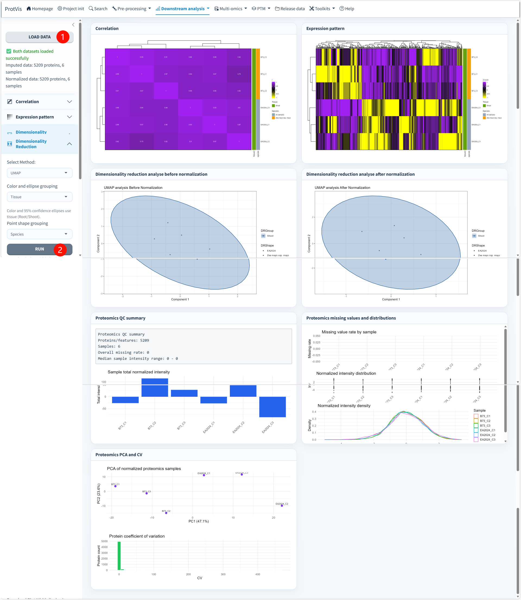

## Purpose

Use **Downstream analysis → Overview** after preprocessing to inspect broad sample/data quality. Project-wide provenance and workflow validity are handled separately by [Project Dashboard](../reproducibility/Project_Dashboard.qmd).

The current Overview loader prefers Step4 + Step6 snapshots. If only the active `ProtVis_dataset` is available, general QC can still use the current matrix, but the archived UMAP reproduction requires `Step4_data_transformed.rda`.

## Current interface

{#fig-overview-qc-gui fig-alt="ProtVis Overview screenshot. Current interface provides correlation, expression pattern, archived UMAP reproduction, normalized intensity density and protein coefficient-of-variation analysis." width="100%" fig-align="center"}

## Correlation

Choose **Pearson, Spearman, or Kendall**, set clustering/display options and run the correlation matrix. ProtVis stores the matrix plus color/plot configuration as a schema-v4 QC run.

Undefined correlations from constant or entirely missing samples remain scientifically undefined; the heatmap can use a neutral display value without rewriting the underlying project data.

## Expression pattern

Select the top variable proteins, choose row/column/no scaling, clustering and color settings, then run the heatmap. This is a global pattern/QC view, not a differential-abundance test.

## Dimensionality reduction: archived UMAP reproduction

The current **Dimensionality Reduction** control is no longer a generic PCA/PCoA/t-SNE/UMAP/NMDS selector. It is an explicit **Run UMAP** route for the archived Figure 3 reproduction:

- transformed **pre-KNN** intensity matrix (Step4);
- five early developmental groups;
- random seed `10086`;
- group colors;
- species point shapes;
- four biological-region ellipses.

Use this mode when reproducing that historical figure. For a new experiment, interpret UMAP only as an exploratory structure view and preserve the preprocessing/seed used.

## Normalized intensity density

The density panel uses the normalized matrix and can color lines by biological triplicate or individual sample. Bandwidth adjustment, line width and legend are presentation controls. The normalized matrix can also be downloaded from this panel.

## Protein coefficient of variation

The CV panel summarizes protein-level variation across the current normalized data. Histogram binning/fill/border settings affect presentation only. Unexpectedly large CV should be interpreted together with missingness, sample design and abundance level.

## Relationship to Project Dashboard

Use **Overview** for detailed exploratory plots. Use **Project Dashboard** for protein/sample counts, data completeness, workflow state, result registry, provenance, input fingerprints and search QC.

::: {.callout-warning}
A cleaner-looking heatmap or UMAP is not evidence that a preprocessing method is correct. Check whether technical alignment improved without erasing expected biological structure.
:::

Once QC is acceptable, continue to [DEP analysis](DEP_analysis.qmd).
