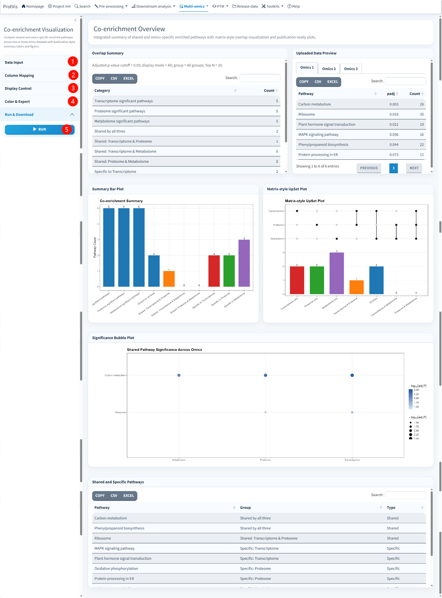

## Purpose

Use **Multi-omics → Co-enrichment** after enrichment analysis has been completed separately for multiple omics layers, contrasts, tissues, or protein clusters. The module compares enrichment results across **two or three omics datasets**, identifies shared and omics-specific pathways, and provides publication-oriented summary tables and plots.

The most important requirement is comparability: enrichment results should use compatible pathway identifiers, annotation versions, and biological backgrounds. A pathway appearing in only one layer can reflect true biology, but it can also arise from incompatible annotation systems or different background universes.

## Co-enrichment interface

The screenshot below shows the current three-omics example with **Transcriptome**, **Proteome**, and **Metabolome** enrichment results. The interface contains Data Input, Column Mapping, Display Control, Color & Export, and Run & Download controls. The result area provides an overlap summary, source-data previews, a summary bar plot, a matrix-style UpSet plot, a significance bubble plot, and a table of shared/specific pathways.

{#fig-co-enrichment-interface fig-alt="Screenshot of ProtVis Multi-omics Co-enrichment. Three enrichment datasets are displayed for Transcriptome, Proteome and Metabolome. The sidebar provides data input, column mapping, display controls, color and export settings, and run/download controls. The main area contains overlap summary, data preview, summary bar plot, matrix-style UpSet plot, significance bubble plot, and shared/specific pathway table." width="100%" fig-align="center"}

## Recommended operating order

**1. Choose two-omics or three-omics mode.** Open **Data Input** and select **Co-enrichment Mode**. Use **Two-omics** when comparing two result sets and **Three-omics** when comparing three layers such as transcriptome, proteome and metabolome.

**2. Name each omics layer.** Set **Omics 1 Name**, **Omics 2 Name**, and, in three-omics mode, **Omics 3 Name**. These labels are propagated into summaries and plots, so use concise names that match the biological analysis.

**3. Load enrichment results.** Upload the enrichment file for each omics layer. ProtVis accepts `.csv`, `.tsv`, `.txt`, `.xlsx`, and `.xls`. For a quick demonstration, click **Use built-in example data**. The built-in example loads representative Transcriptome, Proteome and Metabolome enrichment tables; review the mappings and then run the analysis.

**4. Set the adjusted p-value cutoff.** The default **Adjusted p-value cutoff** is `0.05`. Pathways are considered significant in each layer according to this threshold before shared/specific classifications are summarized.

**5. Decide how duplicate pathway names are handled.** Keep **Remove duplicated pathway names within each omics** selected unless there is a specific reason to preserve duplicate descriptions. This avoids counting the same pathway more than once inside one omics layer.

**6. Verify Column Mapping.** Open **Column Mapping** and, for each uploaded dataset, select the correct **Pathway column** and **Adjusted p-value column**. ProtVis attempts to guess these fields, but the selections should still be checked manually before running the comparison.

**7. Configure Display Control.** Choose **Pathway Display Mode** as **All**, **Shared only**, or **Specific only**. Use the group filter to focus on one overlap class when needed. **Top N pathways in bubble plot** controls how many pathways are shown in the bubble visualization; the current default is `20`. The value-label and sorting options affect presentation rather than pathway classification.

**8. Configure colors and export settings.** Under **Color & Export**, customize colors for shared pathways, pairwise-shared pathways, and omics-specific groups. The UpSet active/inactive colors and bubble low/high colors can also be adjusted. Choose **PDF** or **PNG** for plot downloads; PNG export additionally uses the selected DPI.

**9. Run the analysis.** Open **Run & Download** and click **Run**. After processing, review the summary note above the overlap table to confirm the adjusted p-value cutoff, display mode, group filter, and Top N setting used for the current result.

**10. Inspect the result panels.** **Overlap Summary** reports the pathway classes and counts. **Uploaded Data Preview** lets you inspect the input enrichment tables. **Summary Bar Plot** compares class sizes, **Matrix-style UpSet Plot** shows overlap structure, **Significance Bubble Plot** summarizes pathway significance across layers, and **Shared and Specific Pathways** provides the underlying pathway-level table.

**11. Export tables and plots.** The Run & Download section provides downloadable two-omics and three-omics demo data, the summary table, the pathway table, and individual summary, UpSet, and bubble plots in the selected format.

## Recommended input structure

Each omics enrichment file must contain at least a pathway/term field and an adjusted p-value field. Additional columns can be retained. A minimal example is:

```text
Pathway,padj,Count
Carbon metabolism,0.003,28
Ribosome,0.018,35
Plant hormone signal transduction,0.021,19
```

Column names do not have to match this example exactly because they are assigned explicitly in **Column Mapping**.

## How shared and specific pathways should be interpreted

A pathway classified as shared is present among the significant enrichment results of more than one selected omics layer. A pathway classified as specific is significant only in the corresponding layer under the current cutoff. In three-omics mode, ProtVis can distinguish pathways shared by all three layers, pairwise-shared pathways, and pathways specific to one layer.

Do not interpret overlap alone as evidence that molecular changes occur in the same direction or involve the same genes/proteins/metabolites. Co-enrichment compares pathway-level enrichment membership; directionality and constituent features should be checked in the original differential and enrichment results.

## Practical checks before interpretation

Confirm that all input tables use the same pathway naming/ID system, that enrichment backgrounds are biologically comparable, and that the adjusted p-values were calculated in a compatible way. If pathway descriptions differ only because of database-version naming changes, harmonize identifiers before upload.

::: {.callout-tip}
For cross-omics comparisons, stable pathway identifiers are preferable to free-text descriptions whenever they are available. Descriptions can change between database releases even when the underlying pathway is the same.
:::

::: {.callout-note}
The pathways and counts shown in the screenshot belong to the built-in demonstration and are intended to illustrate the interface. Real results depend on the uploaded enrichment tables, column mappings, p-value cutoff, and display filters.
:::
