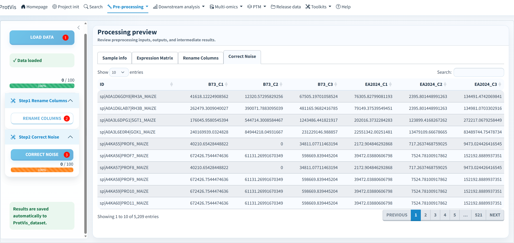

## Role in the current workflow

**Correct Noise** is the first shared quantitative preprocessing module after a source-specific import or Raw database search has created a real protein-by-sample matrix. It prefers the active `ProtVis_dataset` and falls back to compatible stage files when recovering an older project.

Raw projects can arrive here from either **Sage** or **FragPipe**. A search-staging project without a protein matrix must finish Search first.

## Replicate-aware rule

For sample names with `_1`, `_2`, `_3` replicate suffixes, ProtVis groups corresponding replicates per protein:

- if at least two replicates are non-zero, missing/zero cells are replaced by half the sum of non-zero replicate values;
- if fewer than two replicates are observed, that replicate group becomes missing;
- proteins with no positive signal in any replicate are removed in this archived-compatible correction;
- duplicated protein IDs are collapsed first, retaining the largest finite intensity per sample;
- if no recognizable replicate suffix exists, the validated matrix is returned without forcing this replicate rule.

::: {.callout-note}
This is a specific replicate-correction rule, not generic missing-value imputation. The later Imputation module remains a separate operation.
:::

## GUI workflow

{#fig-correct-noise-gui fig-alt="ProtVis Correct Noise module with Load data, Rename Columns, Correct Noise, and input/output tables." width="100%" fig-align="center"}

1. **Load data** and inspect Sample info + Expression Matrix.
2. **Rename Columns** when source identifiers need mapping to canonical sample IDs.
3. **Correct Noise** and inspect the resulting `NA`/row pattern.

Duplicate-run guards prevent the same action from being launched repeatedly while it is already running.

## Outputs

The result is appended as a schema-v4 preprocessing run and saved to the active dataset. Compatibility snapshots can include:

```text
Step2_remove_unreliable_peptide.rda
Step3_correct_noise.rda
```

Continue with [Data transformation](data_transformed.qmd).
