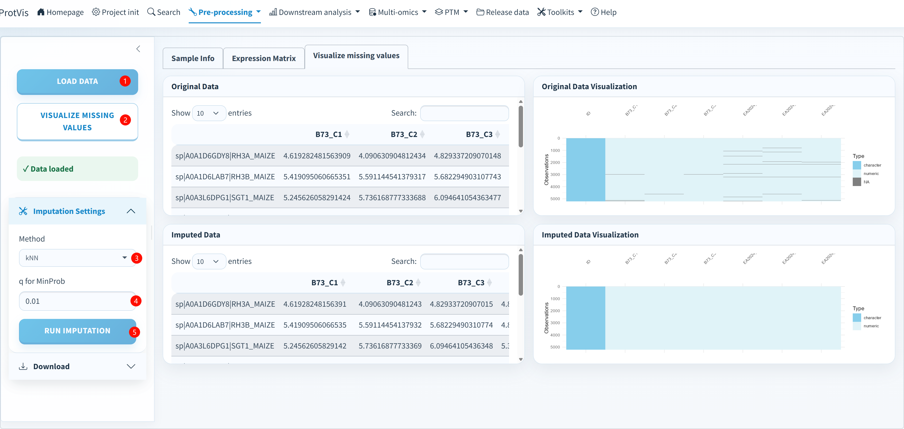

## Why imputation is explicit

Proteomics missingness may reflect abundance limits, identification uncertainty, stochastic sampling or technical failure. ProtVis keeps not-observed values as `NA` until this dedicated stage.

At load time the module converts non-finite values to missing and treats `0`/`-8` sentinels as not observed in the compatibility workflow. Rows/columns that are entirely missing are removed from the matrix passed to the imputation engine.

## Current methods

| Method | Notes |
|---|---|
| **kNN (MaxQuant recommended)** | `impute::impute.knn`; current GUI default |
| **RF** | `missForest::missForest` |
| **Mean** | column-mean replacement |
| **Median** | column-median replacement |
| **Minimum** | column-minimum replacement |

**Zero** and the old **q for MinProb** control are no longer part of the current UI.

## Random seed

The current interface exposes **Random seed**, default:

```text
12345
```

ProtVis calls `set.seed()` before imputation. Preserve this value in Methods when exact reproduction matters.

## GUI workflow

{#fig-data-imputation-gui fig-alt="ProtVis Data Imputation screenshot showing load, missingness visualization, method selection and input/output panels. Current interface now has Random seed and no q-for-MinProb control." width="100%" fig-align="center"}

1. **Load data** from the active Step4/project state.
2. **Visualize missing values** before filling anything.
3. Select the method and confirm the random seed.
4. Click **Run imputation**.
5. Compare original versus imputed tables/visualizations.

ProtVis warns when rows contain more than 50% missing values because similarity-based kNN estimates can become unstable.

::: {.callout-important}
## Recommended DEP does not use Step5 imputed values
Imputation is still useful for heatmaps, complete-matrix QC, normalization benchmarking and other methods that require complete data. The default **Recommended DEP** inferential workflow instead uses observed Step4 intensities and a detection filter to avoid turning imputed values into artificial statistical evidence.
:::

## Output

The imputed matrix is appended as a schema-v4 preprocessing run and persisted for compatibility as:

```text
Step5_data_imputation.rda
```

Continue with [Data normalization](data_normalization.qmd).
