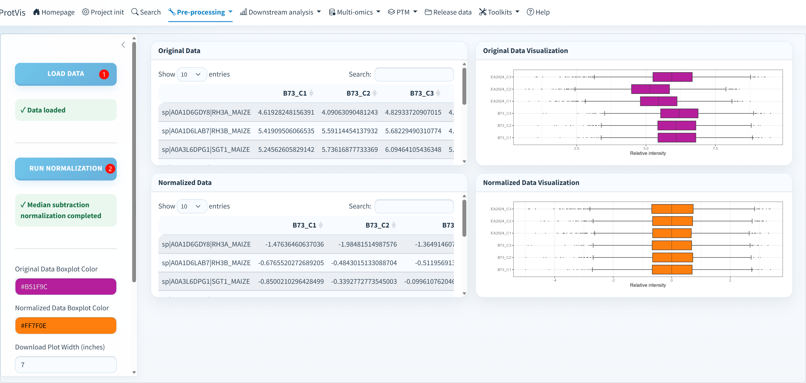

## Normalization is now selectable

ProtVis 0.9.1 no longer provides only fixed median subtraction. The interface supports **Auto (source recommended)** plus multiple explicit normalization families.

Current core methods include:

- **Median**
- **Quantile**
- **VSN**
- **Cyclic Loess**
- **RLR**

The proteiNorm-compatible extension adds:

- Log2 baseline
- Median
- Mean
- VSN
- Quantile
- Cyclic Loess
- RLR
- Global Intensity

Availability can depend on optional packages such as `vsn` or `NormalyzerDE` and on whether the current scale is compatible with the method.

## Source-aware Auto

For MaxQuant, Auto reproduces the archived workflow: sample-wise median subtraction followed by the historical row-wise `+abs(min)+5` shift, with exact zeros mapped to 1. This is a compatibility preset, not a claim that the same procedure is universally appropriate.

For other sources, Auto resolves to the source-specific default.

## Input scale

Choose **Auto from Transformation step**, Raw intensity, log2 or log10. VSN/proteiNorm methods require raw intensities or a safely reversible log2/log10 scale; incompatible transformations are reported as unavailable instead of being applied silently.

## GUI workflow

{#fig-data-normalization-gui fig-alt="ProtVis normalization screenshot. Current interface adds source-aware method selection, input scale, method benchmarking and diagnostic metrics." width="100%" fig-align="center"}

1. Click **Load data** to load the Step5/active project state.
2. Confirm the upstream transformation reported by the status panel.
3. Select input scale and normalization method.
4. Click **Run selected normalization**.
5. Inspect the normalized matrix and distributions.
6. Optionally click **Compare all methods** to benchmark candidate methods.

## Method benchmarking

The comparison workspace reports diagnostic metrics such as sample-median dispersion, sample-IQR dispersion, pairwise correlation, within-group SD, and proteiNorm-style metrics (PCV, PMAD, PEV, intragroup correlation, total-intensity CV and log2-ratio IQR where calculable).

::: {.callout-warning}
## Diagnostics are not an automatic winner
Lower technical dispersion or higher correlation can be useful, but they do not prove that a normalization preserves the biological signal. Choose a method based on acquisition type, scale, design and expected global biology, then record the method explicitly.
:::

## Output

The selected normalized matrix becomes the active matrix, is stored as a schema-v4 preprocessing run, and is persisted for compatibility as:

```text
Step6_data_normalization.rda
```

Overview/QC can use Step6, while **Recommended DEP** intentionally goes back to the observed Step4 matrix for its default inferential model.
