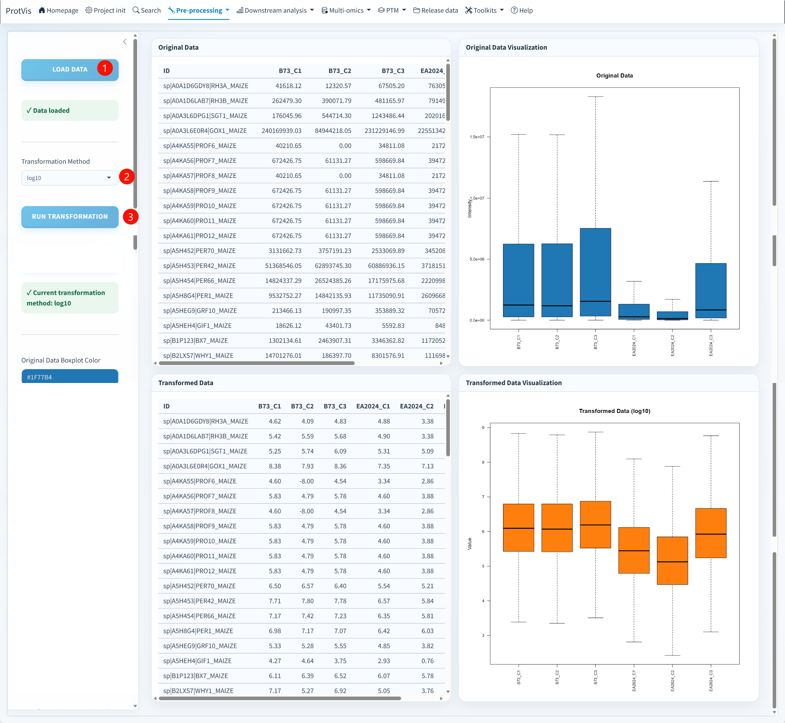

## Current methods

The current transformation selector is grouped into:

**Recommended**

- **Auto (source recommended)**
- **MaxQuant: log2(x × 1e7)**
- **log2**
- **None**
- **log10**

**Advanced**

- **Z-Score**
- **Scale only**
- **Center only**
- **Scale + center**

For MaxQuant, Auto reproduces the archived preprocessing transform `log2(intensity × 1e7)` and requires positive observed intensities. For other sources, Auto resolves to the source-specific preset.

## GUI workflow

{#fig-data-transformation-gui fig-alt="ProtVis Data Transformation page with Load data, transformation selection, Run transformation, input/output tables and boxplots." width="100%" fig-align="center"}

1. Click **Load data** and verify the protein/sample matrix.
2. Select **Auto** or an explicit method.
3. Click **Run transformation**.
4. Compare original and transformed distributions.
5. Export the diagnostic PDFs when they are part of the analysis record.

The screenshot predates the newer source-aware Auto/MaxQuant choices, so use the **current control labels in the running app** rather than copying the screenshot's selected method.

## Choosing the scale

Do not apply log2/log10 to values that are already logarithmic. Advanced scaling methods are useful for pattern visualization but change the quantitative interpretation and may be inappropriate before abundance-based differential models.

## Output and downstream role

The transformed state is recorded in schema v4 and written to the compatibility snapshot:

```text
Step4_data_transformed.rda
```

Step4 is especially important because **Recommended DEP uses the observed transformed matrix before imputation**. Preserve missing values here rather than replacing them merely to make the matrix visually complete.

Continue with [Data imputation](data_imputation.qmd) for analyses requiring a complete matrix, or later use Step4 directly through Recommended DEP.
