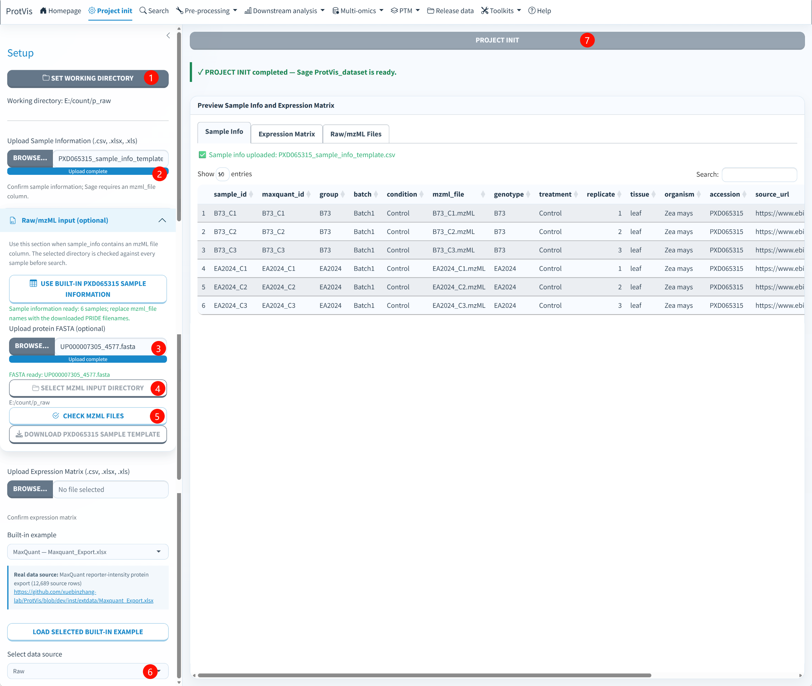

## Purpose

**Project init** defines the working directory, sample metadata, data source and input files that every later module uses. It creates the first validated `ProtVis_dataset`, writes the initial checkpoint and records the input/provenance context.

The current application supports two starting patterns:

- **Quantitative table route:** sample metadata plus a protein-by-sample matrix or a built-in parser example.
- **Raw / LC-MS route:** sample metadata plus LC-MS files and protein FASTA. The project can enter a staging state before a quantitative protein matrix exists.

## Sample information

A practical sample table contains:

| Column | Role |
|---|---|
| `sample_id` | unique sample identifier used downstream |
| `group` | primary comparison group |
| `condition`, `tissue`, `batch`, etc. | optional experimental metadata |
| `maxquant_id` | source/export sample name when mapping tabular software output |
| `mzml_file`, `raw_file`, `file`, or `filename` | LC-MS filename for the Raw/Search route |

Sample IDs and file names must be non-empty and unique.

## Supported data sources

The current selector includes **Raw, MaxQuant, Proteome Discoverer, DIA-NN, Spectronaut, FragPipe, Skyline, Mascot, OpenMS, and User-defined matrix**.

Selecting **Raw** exposes the top-level **Search** page, which now contains **Sage** and **FragPipe** tabs. Selecting **MaxQuant** exposes the MaxQuant-specific Output Preparation step.

## Standard quantitative route

1. Set a writable working directory.
2. Upload sample information.
3. Upload an expression matrix, or load a bundled source example.
4. Select the matching data source.
5. Check the Sample Info and Expression Matrix previews.
6. Click **Project init**.

Parser-backed imports are standardized into the common ProtVis matrix/sample schema and can continue into the shared workflow.

## Raw / LC-MS route

The Raw panel is now labeled **Raw / LC-MS input** because the two Search engines have different input capabilities. Sage uses mzML, while FragPipe can use compatible mzML/mzXML, vendor RAW, MGF or `.d` inputs when supported by the official runtime.

{#fig-project-init-raw fig-alt="ProtVis Project init screenshot for the PXD065315 Raw example. The workflow sets a working directory, sample information, FASTA and mzML directory, checks files, selects Raw, and runs Project init." width="100%" fig-align="center"}

### Recommended order

**1. Set working directory.** Use a stable, writable project folder. Search outputs, checkpoints and portable exports will be written relative to this project.

**2. Load sample information.** Upload a table or use the built-in PXD065315 sample template. For Raw/Search projects, include `sample_id` and the LC-MS filename field.

**3. Upload protein FASTA.** Accepted FASTA extensions include `.fa`, `.fasta`, `.faa` and supported compressed forms.

**4. Select the LC-MS directory.** The files listed in the sample table must exist in this directory.

**5. Click Check LC-MS files.** ProtVis accepts file extensions needed by the Search backends: `.mzML`, `.mzXML`, vendor `.raw`, `.mgf`, and `.d` directories/files where applicable. The built-in PXD065315 Sage example uses `.mzML`.

**6. Select Raw.** This enables the top-level Search page.

**7. Click Project init.** A Raw project can be initialized without fabricating protein abundances. The next step is Search.

::: {.callout-important}
## Do not fabricate an expression matrix for a Raw project
A Raw project is allowed to exist before the protein matrix is created. For the Sage route, this is the `Sage_staging` state. Database search must succeed before quantitative preprocessing begins.
:::

## Built-in PXD065315 template

The bundled template uses six maize control samples: `B73_C1`–`B73_C3` and `EA2024_C1`–`EA2024_C3`, with local filenames such as `B73_C1.mzML`.

The original vendor files are available from [PXD065315 on PRIDE](https://www.ebi.ac.uk/pride/archive/projects/PXD065315). For the Sage route, convert them to mzML first. For FragPipe, use an input format supported by the selected official workflow/runtime.

## Outputs

Project init writes:

```text
Step1_project_init.rda
```

and maintains the active `ProtVis_dataset`. Schema v4 also initializes the run registry, workflow graph, artifact index and provenance structures.

After initialization:

- Raw project → open **Search → Sage** or **Search → FragPipe**;
- quantitative project → inspect **Project Dashboard**, then continue with the source-specific preparation/shared preprocessing path.

## Common problems

**LC-MS check reports Missing.** The filename in sample metadata must match the physical file exactly.

**Invalid extension.** Use a Search-supported LC-MS format; Sage specifically requires mzML.

**Search is hidden.** Select **Raw** in Project init.

**Quantitative matrix does not align with sample metadata.** Check sample IDs/source names before initialization rather than silently reordering outside ProtVis.
