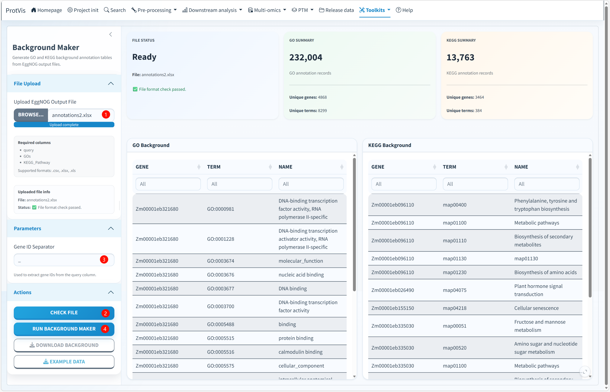

## Purpose

Use **Toolkits → Background make** to convert an eggNOG-mapper-style annotation table into the GO and KEGG background workbook used by ProtVis enrichment analysis. The module validates the annotation fields, extracts stable gene IDs, expands multi-valued GO/KEGG annotations, attaches term names, and exports a reproducible Excel workbook.

## Background Maker interface

The screenshot below shows a completed maize example using `annotations2.xlsx`. The three summary cards report file status, GO annotation statistics and KEGG annotation statistics, while the two large tables preview the generated `GO Background` and `KEGG Background` records.

{#fig-background-maker-interface fig-alt="Screenshot of ProtVis Toolkits Background Maker. annotations2.xlsx has passed file-format validation. File Status, GO Summary and KEGG Summary cards are shown above GO Background and KEGG Background tables, with File Upload, Gene ID Separator, Check File, Run Background Maker, Download Background and Example Data controls in the sidebar." width="100%" fig-align="center"}

The values visible in this screenshot—such as 232,004 GO records and 13,763 KEGG records—belong only to this example annotation file and are not fixed ProtVis outputs.

## Required input

Upload an eggNOG output table in `.csv`, `.xlsx`, or `.xls` format. The current module requires these exact columns:

```text
query
GOs
KEGG_Pathway
```

`GOs` and `KEGG_Pathway` may contain multiple comma-separated annotations for one query sequence.

## Recommended operating order

**1. Upload the eggNOG annotation file.** In **File Upload**, choose the annotation table. After upload, the file information panel shows the selected filename and the current validation state.

**2. Check the file before generating a background.** Click **Check File**. ProtVis verifies that `query`, `GOs`, and `KEGG_Pathway` are present. Continue only when the status reports **File format check passed**. The **Run Background Maker** action is intended to be used after this validation step.

**3. Set the Gene ID Separator.** The default separator is `_`. ProtVis uses this character to extract the stable ID from the beginning of the `query` field. For example:

```text
Zm00001eb321680_T001
```

with `_` becomes:

```text
Zm00001eb321680
```

Choose a separator that matches the identifier convention of the uploaded annotation. Do not use `_` automatically when your IDs follow a different scheme.

**4. Run Background Maker.** Click **Run Background Maker**. ProtVis expands comma-separated GO terms, retrieves GO term names from `GO.db`, removes unresolved GO annotations, and creates distinct `GENE`, `TERM`, `NAME` records. For KEGG, it keeps pathway IDs matching the `map#####` form and obtains pathway names from the KEGG pathway list when available.

**5. Review the summary cards.** **FILE STATUS** confirms whether the source file passed validation. **GO SUMMARY** and **KEGG SUMMARY** report record counts, unique genes and unique terms. Large differences between the number of source genes and annotated genes are expected when some genes lack GO or KEGG assignments, but unexpected losses should be investigated.

**6. Inspect both output tables.** The **GO Background** and **KEGG Background** cards show the enrichment-ready records. Each table should contain:

```text
GENE
TERM
NAME
```

Check a few known genes and pathways before using the workbook for enrichment analysis.

**7. Download the background workbook.** Click **Download Background**. ProtVis writes a file named like `background_YYYY-MM-DD.xlsx` containing three worksheets: `Summary`, `GO_background`, and `KEGG_background`. The Summary sheet records the uploaded file and the generated record/gene/term counts.

**8. Use Example Data when learning the format.** **Example Data** downloads `background_maker_example_data.csv`, which can be used as a minimal template for the three required source columns.

## How GO and KEGG records are generated

For GO annotations, ProtVis separates the comma-delimited `GOs` field, removes missing or `-` entries, extracts the stable gene ID, maps each GO ID to its term name, removes terms that cannot be resolved, and de-duplicates the resulting records.

For KEGG, ProtVis separates `KEGG_Pathway`, keeps valid `map` pathway identifiers such as `map01100`, and resolves pathway names through the KEGG pathway-list service. If a pathway-name lookup is unavailable, the current implementation can retain the pathway ID itself as the name rather than discarding that valid mapping.

::: {.callout-important}
## Use the correct enrichment universe
The background should represent the genes/proteins that could realistically have been detected or tested in the experiment. Do not build the background only from significant proteins; doing so changes the statistical universe and can distort enrichment results.
:::

::: {.callout-tip}
Keep the generated workbook together with the eggNOG source file and record the annotation/database version. This makes later enrichment results substantially easier to reproduce.
:::
