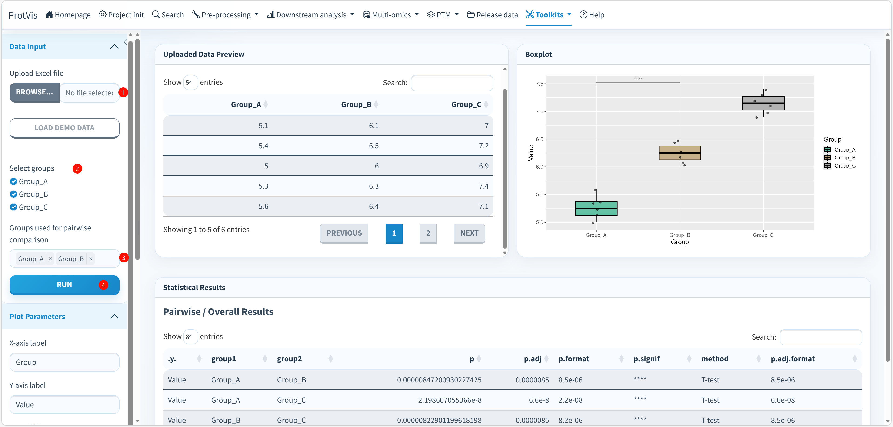

## Purpose

Use **Toolkits → Boxplot** to compare quantitative values among multiple groups, display the underlying observations, add statistical annotations, and export both the figure and the statistical results. The module accepts an Excel table in **wide format**, where each selected column represents one group.

## Boxplot interface

The screenshot below shows the bundled demonstration data with three groups (`Group_A`, `Group_B`, and `Group_C`). The example contains six observations per group. The visible pairwise p-values and significance symbols belong only to this demonstration dataset.

{#fig-boxplot-interface fig-alt="Screenshot of ProtVis Toolkits Boxplot. Demo data for Group_A, Group_B and Group_C are loaded. The sidebar includes Data Input, group selection, groups used for pairwise comparison and plot parameters. The main area contains Uploaded Data Preview, a boxplot with individual points and Statistical Results including pairwise t-test p-values and BH-adjusted p-values." width="100%" fig-align="center"}

## Input format

Upload a `.xlsx` table in wide format. Each quantitative group should occupy one column:

```text
Group_A  Group_B  Group_C
5.1      6.1      7.0
5.4      6.5      7.2
5.0      6.0      6.9
5.3      6.3      7.4
5.6      6.4      7.1
5.2      6.2      7.3
```

This is also the structure of the current built-in demonstration data. After group selection, ProtVis reshapes the selected columns into `Group` and `Value` fields. Missing values are removed; values that cannot be converted to numeric are also excluded from plotting and statistical analysis.

## Recommended operating order

**1. Load the data.** Under **Data Input**, upload an Excel `.xlsx` file or click **LOAD DEMO DATA**. Demo data are provided so the complete workflow can be tested without preparing a file first.

**2. Check Uploaded Data Preview.** Confirm that the column names are the intended group names and that the quantitative values have been read correctly. In the demonstration screenshot the table contains `Group_A`, `Group_B`, and `Group_C`.

**3. Select groups to display.** Under **Select groups**, choose the columns that should be retained in the boxplot and analysis. The order of these selections is preserved as the group order in the plot.

**4. Choose groups used for pairwise comparison.** **Groups used for pairwise comparison** controls which groups enter the pairwise comparison set. When at least two groups are selected, ProtVis generates all pair combinations among those selected groups. This control is directly relevant to `t.test` and `wilcox.test`.

**5. Select the statistical method.** Open **Statistics** and choose one of the current methods:

- `t.test`: pairwise t-tests for the selected comparison groups;
- `wilcox.test`: pairwise Wilcoxon tests;
- `anova`: one-way ANOVA followed by a TukeyHSD result table;
- `kruskal.test`: overall Kruskal-Wallis test.

The current default is `t.test`.

**6. Decide whether significance labels should appear on the plot.** Keep **Show significance labels on plot** selected when statistical annotations are desired. Pairwise t-test/Wilcoxon analyses display pairwise significance labels, whereas ANOVA and Kruskal-Wallis display an overall p-value.

**7. Configure Plot Parameters.** Set **X-axis label** and **Y-axis label**, adjust **Box width** and **Point size**, decide whether to **Show data points**, choose the box-line color, and set individual group fill colors. Showing individual points is recommended when sample size is modest because it makes the underlying observations visible instead of relying on the box summary alone.

**8. Choose a theme.** Available themes are **minimal**, **classic**, **light**, **bw**, **dark**, and **grey**. The current default is `grey`.

**9. Click Run.** ProtVis reshapes the selected groups, removes missing/non-numeric values, performs the selected statistical analysis, and generates the boxplot.

**10. Review Statistical Results.** For pairwise t-tests or Wilcoxon tests, the result table includes the compared groups, raw `p`, BH-adjusted `p.adj`, formatted values, significance symbols and method. In the screenshot, all three pairwise comparisons are significant because this is a deliberately separated demo dataset; those values are not reference thresholds for biological data.

**11. Review ANOVA/Tukey or Kruskal output when those methods are selected.** ANOVA produces an **ANOVA Results** table plus **TukeyHSD Results**. Kruskal-Wallis produces the overall test statistic, degrees of freedom and p-value. The current Kruskal option is an overall test and does not automatically create a post-hoc pairwise table.

**12. Export the figure and statistics.** Under **Download**, choose `pdf`, `png`, `jpg`, or `svg`, set figure width and height, and set DPI for PNG/JPG output. **Download Plot** exports the current figure. **Download Statistics** writes an Excel workbook named like `boxplot_statistics_YYYY-MM-DD.xlsx` containing the available statistical result tables.

## Statistical behavior

For `t.test` and `wilcox.test`, ProtVis uses `ggpubr::compare_means()` across all pair combinations generated from the selected comparison groups. The statistical-results table uses **Benjamini-Hochberg (BH)** multiple-testing adjustment and exposes the adjusted p-value as `p.adj`.

For `anova`, ProtVis fits a one-way model:

```text
Value ~ Group
```

and reports the ANOVA table together with TukeyHSD post-hoc comparisons. For `kruskal.test`, the current implementation reports the overall Kruskal-Wallis result.

## Interpreting the plot

The box represents the distribution summary for each group, while the optional jittered points show the individual observations. A small p-value indicates evidence against the null hypothesis under the selected test, but it does not by itself describe effect size or biological importance. Interpret the figure together with the group distributions, sample size and experimental design.

::: {.callout-important}
## Match the test to the experimental design
The current pairwise t-test/Wilcoxon workflow treats the groups as independent. Do not use it for paired or repeated-measures designs unless the statistical model correctly accounts for that structure. ANOVA and Kruskal-Wallis likewise assume an appropriate independent-group design in the current module.
:::

::: {.callout-tip}
For figures intended for publication, keep the individual points visible when feasible and report the exact statistical test, multiple-testing correction, sample size and whether observations are independent or paired in the figure legend or Methods section.
:::
