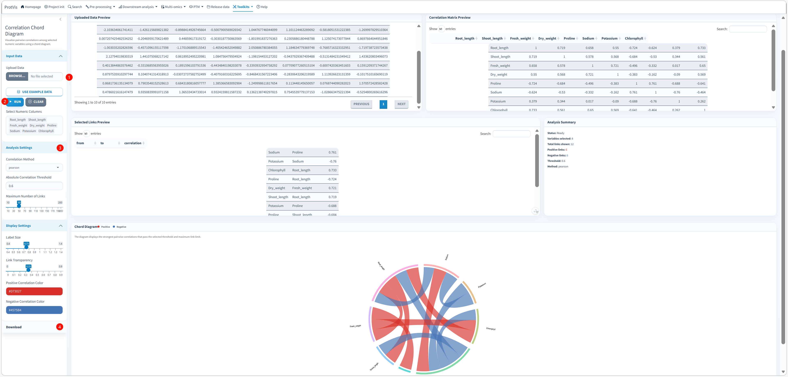

## Purpose

Use **Toolkits → Correlation chord** to explore relationships among numeric traits, proteins, metabolites, pathways or other quantitative variables. ProtVis calculates a correlation matrix from selected columns, filters relationships by absolute correlation, retains the strongest links up to a user-defined maximum, and displays the result as a chord diagram.

This module is designed for a focused correlation network rather than for drawing every possible pair. Filtering keeps the diagram interpretable and makes the exact displayed relationships available as a table.

## Correlation Chord interface

The screenshot below shows the built-in example containing eight variables: `Root_length`, `Shoot_length`, `Fresh_weight`, `Dry_weight`, `Proline`, `Sodium`, `Potassium`, and `Chlorophyll`. In this example the analysis uses Pearson correlation and an absolute correlation threshold of `0.6`; the displayed link counts belong only to this demonstration dataset.

{#fig-correlation-chord-interface fig-alt="Screenshot of ProtVis Toolkits Correlation Chord Diagram. Eight numeric variables are loaded from the example dataset. The interface shows Uploaded Data Preview, Correlation Matrix Preview, Selected Links Preview, Analysis Summary and Chord Diagram, with Pearson correlation, absolute threshold 0.6 and configurable maximum links and display settings." width="100%" fig-align="center"}

## Recommended operating order

**1. Load a numeric dataset.** Under **Input Data**, upload `.csv`, `.tsv`, or `.txt`, or click **Use Example Data**. The built-in example contains 48 observations for the eight variables shown in the screenshot.

**2. Select the variables.** Use **Select Numeric Columns** to choose at least two numeric columns. ProtVis automatically offers only numeric variables from the loaded table.

**3. Choose the correlation method.** Under **Analysis Settings**, select **pearson**, **spearman**, or **kendall**. Pearson is the current default. Pearson summarizes linear association, whereas rank-based Spearman or Kendall can be more appropriate for monotonic relationships or data that do not satisfy Pearson assumptions.

**4. Set the Absolute Correlation Threshold.** The default is `0.6`. ProtVis retains a pair only when `abs(correlation) >= threshold`, so the same cutoff applies to positive and negative relationships.

**5. Set Maximum Number of Links.** The current control ranges from 10 to 200 and defaults to 50. After the threshold filter, ProtVis sorts relationships by absolute correlation from strongest to weakest and keeps at most this many links. This limit is especially important when many variables are selected.

**6. Click Run.** ProtVis calculates the correlation matrix using pairwise-complete observations, removes self-correlations, collapses the two directions of each variable pair into one link, applies the absolute-correlation threshold, and then applies the maximum-link limit.

**7. Review the previews before interpreting the diagram.** **Uploaded Data Preview** shows the source values, **Correlation Matrix Preview** shows the complete selected-variable matrix, and **Selected Links Preview** shows the exact filtered edges that are sent to the chord diagram.

**8. Check Analysis Summary.** The summary reports status, number of selected variables, total links shown, positive and negative link counts, threshold, and correlation method. This provides a compact record of the settings behind the displayed network.

**9. Adjust Display Settings.** **Label Size** changes variable-label size; **Link Transparency** controls visual opacity; **Positive Correlation Color** and **Negative Correlation Color** set the two link classes. The current defaults are red `#D73027` for positive and blue `#4575B4` for negative correlations.

**10. Export the result.** The **Download** section provides PDF and PNG versions of the chord diagram plus `correlation_matrix.csv`. Keep the matrix together with the figure so the exact numerical relationships remain available independently of the visualization.

## Input format

A typical input table has observations in rows and numeric variables in columns:

```text
Root_length,Shoot_length,Fresh_weight,Proline,Sodium
12.3,18.4,5.8,1.21,0.42
10.9,16.7,5.1,1.56,0.71
14.2,20.1,6.3,0.98,0.35
```

Non-numeric columns can remain in the uploaded file, but only numeric columns are available for correlation analysis.

## How links are selected

For the selected variables, ProtVis calls the correlation calculation with `use = "pairwise.complete.obs"`. It then removes diagonal correlations and duplicate mirrored pairs such as A–B versus B–A. Pairs failing the absolute threshold are removed. The surviving pairs are ordered by `|r|` or the corresponding absolute rank-correlation coefficient, and only the strongest `Maximum Number of Links` are retained.

This means the chord diagram can intentionally show fewer relationships than the full correlation matrix. Use **Selected Links Preview** when you need the precise edge list represented in the figure.

::: {.callout-warning}
## Correlation is not causation
A strong chord indicates statistical association, not a causal relationship. For large correlation screens, also consider sample size, multiple testing, repeated-measures structure, and confounding variables before making biological conclusions.
:::

::: {.callout-tip}
If the diagram is crowded, increase the absolute-correlation threshold or reduce the maximum number of links rather than shrinking labels until the network becomes unreadable.
:::
