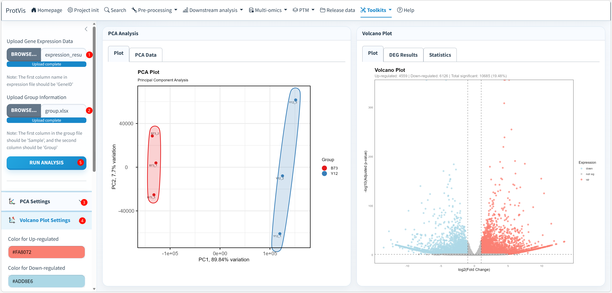

## Scope

**Toolkits → DEG analyse** is an RNA-seq-oriented utility and is separate from ProtVis's main **DEP analysis**. The current implementation builds a `DESeq2::DESeqDataSetFromMatrix`, uses `design = ~ Group`, runs `DESeq2::DESeq()`, and produces PCA and volcano/result views.

Use this toolkit for **raw count-style gene-expression data** that are appropriate for DESeq2. Do not use it for normalized continuous proteomics intensities merely because proteins and RNA-seq both have samples in columns.

## DEG Analyse interface

The screenshot below shows a completed analysis with the PCA card on the left and the Volcano Plot card on the right. The displayed counts—4,559 up-regulated, 6,126 down-regulated and 10,685 significant features (19.48%)—belong to this particular uploaded example and are not fixed ProtVis results.

{#fig-deg-analyse-interface fig-alt="Screenshot of ProtVis Toolkits DEG Analyse. Gene-expression and group-information Excel files are loaded, PCA Analysis and Volcano Plot result cards are displayed, and the sidebar contains PCA Settings and Volcano Plot Settings. The result tabs include Plot, PCA Data, DEG Results and Statistics." width="100%" fig-align="center"}

## Required files

The current module accepts Excel `.xlsx` files for both inputs.

The **Gene Expression Data** workbook must contain an exact first-column identifier named:

```text
GeneID
```

The remaining columns are sample count columns. The **Group Information** workbook must contain at least:

```text
Sample
Group
```

`Sample` names must correspond to the expression-matrix sample columns because ProtVis reorders the count matrix using the row names created from the `Sample` field.

## Recommended operating order

**1. Upload Gene Expression Data.** Select the count-matrix `.xlsx`. Keep genes in rows and samples in columns. The first column must be named exactly `GeneID`.

**2. Upload Group Information.** Select the grouping `.xlsx`. The first required field is `Sample` and the second is `Group`. Additional grouping columns can also be present and may become available for PCA color/shape mappings.

**3. Verify that the data are raw counts.** Before running, confirm that sample columns represent non-negative count data appropriate for DESeq2. In the current implementation ProtVis applies `ceiling()` to all sample values before constructing the DESeq2 count matrix; this is not a justification for supplying normalized continuous expression values.

**4. Be aware of the current contrast.** The present `dev` implementation extracts differential results with:

```text
Group: B73 versus Y12
```

specifically `contrast = c("Group", "B73", "Y12")`. Therefore the current toolkit expects the `Group` column to contain the `B73` and `Y12` levels for differential testing. If your biological comparison uses different group names, this utility should not be treated as a generic arbitrary-group DEG interface without changing the underlying implementation.

**5. Configure PCA Settings.** Choose **Color by** and optionally **Shape by** from available grouping fields. Point size can be Small, Medium or Large. When grouping is used, ProtVis provides per-group color selectors. You can also show sample labels, encircle groups and display confidence ellipses; ellipse transparency and legend text size are configurable.

**6. Configure Volcano Plot Settings.** Set colors for **Up-regulated**, **Down-regulated**, and **Not Significant** points, point size, transparency, and grid display. These controls alter presentation only; they do not change the DEG classification threshold in the current implementation.

**7. Click Run Analysis.** ProtVis converts `GeneID` to row names, applies `ceiling()` to sample counts, aligns columns to the group-information sample order, creates a DESeq2 dataset with `design = ~ Group`, runs DESeq2, and extracts the B73-versus-Y12 result.

**8. Inspect PCA Analysis.** The **Plot** tab shows sample separation in principal-component space. Use **PCA Data** to inspect/export the coordinates rather than relying only on the figure. The percentage of variation displayed on PC1/PC2 is dataset-specific.

**9. Inspect the Volcano Plot and DEG tables.** The **Plot** tab displays fold change against significance. **DEG Results** exposes the underlying DESeq2 result table, while **Statistics** provides summary counts and top DEG information.

**10. Export the analysis outputs.** PCA settings provide PDF and PCA-data downloads. Volcano settings provide PDF and DEG-data downloads. The PCA and DEG table tabs also include CSV export controls.

## Current DEG classification rule

The current implementation classifies a gene as **Up-regulated** when:

```text
adjusted p-value < 0.05
and log2FoldChange > 1
```

and as **Down-regulated** when:

```text
adjusted p-value < 0.05
and log2FoldChange < -1
```

All other genes are labeled **Not significant**. In other words, the current significance rule is `padj < 0.05` together with `|log2FoldChange| > 1`.

## PCA and volcano presentation controls

PCA supports grouping color, grouping shape, three point-size levels, optional sample labels, group encircling, confidence ellipses, ellipse transparency and legend-size control. Default PCA export dimensions are 8 × 7 inches.

The volcano plot defaults to salmon for up-regulated genes, light blue for down-regulated genes and grey for non-significant genes; default point size is 2 and transparency is 0.7. Default volcano PDF dimensions are also 8 × 7 inches.

::: {.callout-important}
## This is not the main proteomics DEP workflow
For normalized protein-abundance data, use **Downstream analysis → DEP analysis**. The DEG toolkit is built around DESeq2 count modeling and its current code contains a fixed B73-versus-Y12 contrast.
:::

::: {.callout-warning}
Do not convert continuous normalized measurements into pseudo-counts merely to make them pass this interface. Statistical model choice should follow the measurement process and data distribution.
:::
