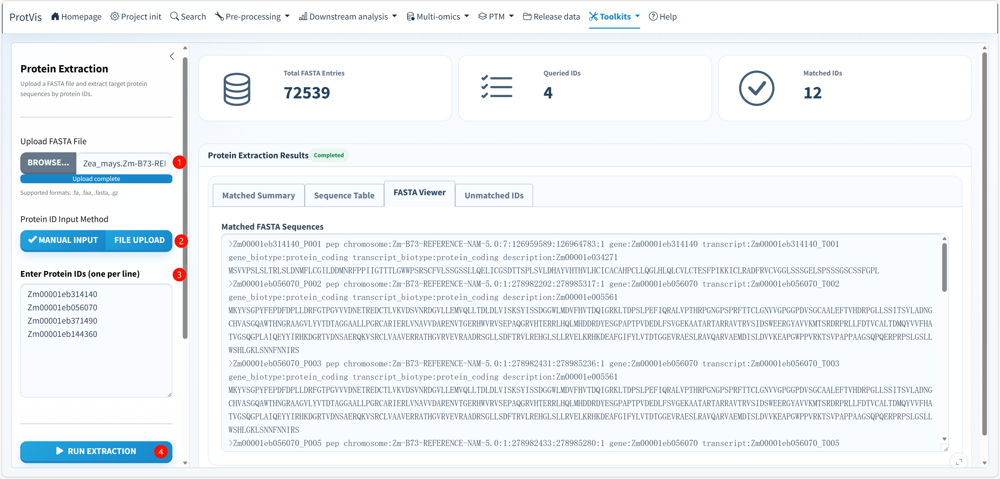

## Purpose

Use **Toolkits → Protein extract** when you have a reference protein FASTA and a list of candidate gene/protein IDs and need the corresponding sequences for structure prediction, primer/tag design, domain analysis or other downstream work.

The current ProtVis matcher is not limited to literal header equality. It first attempts an exact header-token match, then a normalized stable-ID match, and finally allows a unique one-character fuzzy match under restricted conditions. This makes the module useful for FASTA files whose headers contain transcript/protein isoform suffixes.

## Protein Extraction interface

The screenshot below shows a maize reference FASTA with four queried stable IDs. The example FASTA contains 72,539 entries, and one stable query can match multiple FASTA isoforms, which is why the displayed number of matched FASTA sequences can be larger than the number of queried IDs.

{#fig-protein-extract-interface fig-alt="Screenshot of ProtVis Toolkits Protein Extraction. A Zea mays FASTA is loaded, four maize stable IDs are entered manually, the result status is Completed, and the main panel contains Total FASTA Entries, Queried IDs, Matched IDs plus Matched Summary, Sequence Table, FASTA Viewer and Unmatched IDs tabs." width="100%" fig-align="center"}

## Recommended operating order

**1. Upload the reference protein FASTA.** Supported inputs include `.fa`, `.faa`, `.fasta`, and their gzip-compressed forms such as `.fa.gz`, `.faa.gz`, and `.fasta.gz`.

**2. Choose the Protein ID Input Method.** Select **Manual Input** to paste one ID per line, or **File Upload** to provide a `.txt`, `.csv`, or `.tsv` ID list. For CSV/TSV inputs, ProtVis reads all non-empty values as candidate identifiers, so keep unrelated metadata out of the file.

**3. Review the query IDs.** Remove accidental duplicates and blank lines. Stable gene IDs are often preferable when the goal is to retrieve all corresponding protein/transcript isoforms; isoform-specific IDs are appropriate when only one record is intended.

**4. Click Run Extraction.** ProtVis parses the FASTA headers, matches the requested IDs and enables **Download Results** when at least one FASTA sequence has been recovered.

**5. Check the three summary metrics.** **Total FASTA Entries** is the number of sequences in the reference FASTA. **Queried IDs** is the number of unique input IDs. The current UI label **Matched IDs** counts matched FASTA sequence entries, not necessarily unique input IDs; therefore it can exceed Queried IDs when one stable query maps to several isoforms.

**6. Review Matched Summary.** Use this tab to confirm which input IDs were found and how they were matched. Do not assume that every returned isoform is biologically equivalent; the FASTA annotation determines which protein records are associated with a stable gene/transcript identifier.

**7. Inspect Sequence Table and FASTA Viewer.** **Sequence Table** provides structured sequence information, while **FASTA Viewer** shows the matched records in FASTA format. In the screenshot, several records from the same maize stable ID are visible because the reference contains multiple protein/transcript isoforms.

**8. Check Unmatched IDs.** This tab should always be reviewed before downstream analysis. An unmatched candidate may indicate a database-version mismatch, an unexpected header convention, a genuinely absent sequence, or a query too different to satisfy the controlled fuzzy-matching rule.

**9. Download the result package.** **Download Results** generates `protein_extract_results_YYYY-MM-DD.zip`. The ZIP contains `matched_sequences.fasta`, `summary.txt`, and `unmatched_ids.txt`.

## How ID matching works

ProtVis searches FASTA header tokens using three stages. First, it tries an exact case-insensitive token match. If that fails, it compares normalized stable IDs. Normalization removes common `gene:`, `transcript:`, or `protein:` prefixes, leading `>`, trailing descriptive text, common protein/transcript/isoform suffixes such as `_P001`, `_T002`, `-isoform1`, and terminal numeric version suffixes.

If neither exact nor normalized matching succeeds, ProtVis can use a **one-character fuzzy match** only when the canonical query is at least eight characters long and the approximate comparison identifies a single stable ID. This last restriction reduces the risk of silently selecting one of several equally plausible near matches.

::: {.callout-warning}
## Inspect multi-isoform matches
A stable gene ID can legitimately return multiple FASTA entries. The summary metric therefore reflects matched sequence records rather than a strict one-query/one-sequence relationship. Use the Sequence Table and FASTA headers to decide which isoform is appropriate for downstream work.
:::

::: {.callout-tip}
Keep the `unmatched_ids.txt` file even when only a few queries fail. It is a useful record for diagnosing reference-version and identifier-conversion problems later.
:::
