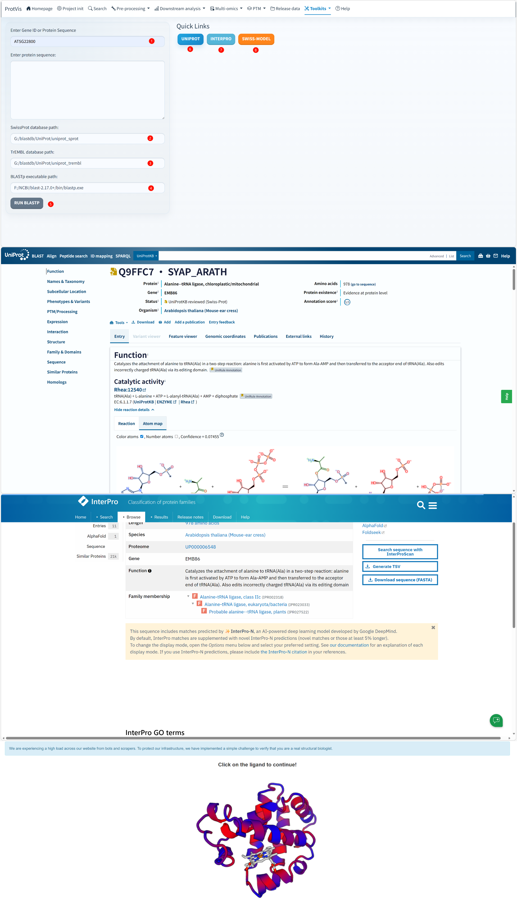

## Purpose

Use **Toolkits → Protein links** when you want to move quickly from a gene/protein identifier or an amino-acid sequence to external protein resources. ProtVis supports two routes: a direct identifier lookup through the UniProt REST service, or a local **BLASTP** fallback against user-configured Swiss-Prot and TrEMBL databases.

After a UniProt accession has been resolved, ProtVis provides quick links to **UniProt**, **InterPro**, and the **SWISS-MODEL Repository**. This makes Protein Links the natural entry point for moving from an identifier to annotation and then to structure-oriented inspection.

## Protein Links interface

The full-resolution screenshot below shows the current interface using `AT5G22800` as an example query. The right side illustrates the external annotation pages reached from the resolved protein entry. The Windows BLAST database and executable paths visible in the screenshot belong to that computer only and should not be copied literally to another machine.

{#fig-protein-links-interface fig-alt="Screenshot of ProtVis Toolkits Protein Links. The left panel contains Enter Gene ID or Protein Sequence, a protein-sequence box, SwissProt and TrEMBL database paths, the BLASTp executable path and Run BLASTp. The example query AT5G22800 is resolved to a UniProt entry and external UniProt and InterPro annotation pages are shown on the right." width="100%" fig-align="center"}

## Swiss-Model structure result from Protein Links

After the protein identity has been resolved, the structure-related link can be used to continue into Swiss-Model-oriented inspection. The screenshot below belongs in this **Protein Links** workflow because it illustrates the structure follow-up reached after protein identification and annotation rather than the initial identifier-mapping step itself.

{#fig-protein-links-swissmodel fig-cap="Structure follow-up from Toolkits → Protein Links. ProtVis displays Swiss-Model project information, model-quality results and tabs for PDB information, Ramachandran analysis, residue composition and 3D structure inspection. The API-token value is redacted." width="100%" fig-align="center"}

The structure view should be interpreted in the following order: first confirm the resolved protein and sequence; then inspect the returned **Project Information** and **Model Quality**; finally use **PDB Information**, **Ramachandran Plot**, **Residue Composition**, and **3D Structure** to evaluate the model. If the structure is used in a figure or candidate-gene interpretation, record the model/project identifier and quality information together with the protein accession.

::: {.callout-important}
Treat a Swiss-Model API token as a credential. Do not publish it in screenshots, manuscripts, repositories, or shared project files. The token field in the screenshot above has been redacted.
:::

## Route 1: direct gene or protein identifier lookup

**1. Enter a gene identifier or UniProt-compatible identifier.** Type the identifier in **Enter Gene ID or Protein Sequence**. In the screenshot, the example is `AT5G22800`.

**2. Let ProtVis query UniProt.** For a non-empty identifier, the current implementation sends a UniProtKB search request and uses the **first returned primary accession**. No local BLAST database is required for this route.

**3. Check the resolved protein before interpreting it.** Open **UniProt** and verify the organism, gene/protein name, sequence length and functional annotation. In the screenshot, the example resolves to an Arabidopsis protein entry. The exact accession and annotation displayed are example-specific and should not be treated as expected output for another identifier.

**4. Follow the Quick Links.** Once a UniProt accession is available, ProtVis builds direct links to **UniProt**, **InterPro**, and **SWISS-MODEL Repository**. UniProt and InterPro may themselves expose additional links to resources such as AlphaFold or other structural/domain services, but these are external-site links rather than additional ProtVis mapping steps.

## Route 2: sequence-based BLASTP fallback

Use this route when a stable identifier is unavailable or direct UniProt mapping does not resolve the protein.

**1. Paste the amino-acid sequence.** Enter the protein sequence in **Enter protein sequence**. Remove FASTA description text unless it is intentionally part of the sequence input.

**2. Set the Swiss-Prot database path.** **SwissProt database path** must point to a local BLAST-formatted Swiss-Prot protein database.

**3. Set the TrEMBL database path.** **TrEMBL database path** must point to a local BLAST-formatted TrEMBL protein database.

**4. Set the BLASTP executable path.** **BLASTp executable path** must point to the local NCBI BLAST+ `blastp` executable. For example, on Windows this is typically a path ending in `blastp.exe`.

**5. Click Run BLASTP.** ProtVis writes the sequence to a temporary FASTA file and runs BLASTP in XML output mode. The current search strategy queries **Swiss-Prot first** and only searches **TrEMBL if no Swiss-Prot hit is returned**.

**6. Verify the mapped hit.** The underlying BLAST helper retrieves the top hit and calculates sequence identity from the HSP identity count divided by aligned length. Treat this result as a candidate mapping that still requires biological review.

**7. Use the resolved accession to open external resources.** When a UniProt accession can be obtained, the same UniProt, InterPro and SWISS-MODEL quick links become available.

## Local BLAST setup

The paths shown in the screenshot are examples from one Windows installation:

```text
SwissProt database path: G:/blastdb/UniProt/uniprot_sprot
TrEMBL database path:    G:/blastdb/UniProt/uniprot_trembl
BLASTp executable path:  F:/NCBI/blast-2.17.0+/bin/blastp.exe
```

Replace all three with paths that exist on your own computer. The Swiss-Prot and TrEMBL databases must already be prepared in a BLAST-compatible format; entering the path to a downloaded FASTA file alone is not equivalent to providing a formatted BLAST database.

## How the current lookup priority works

The current server logic follows this order:

```text
Gene/protein identifier
        ↓
UniProt REST search
        ↓
first primary accession
        ↓
UniProt / InterPro / SWISS-MODEL links
```

If direct identifier mapping is unavailable and a protein sequence is supplied, ProtVis uses:

```text
protein sequence
      ↓
Swiss-Prot BLASTP
      ↓ no hit
TrEMBL BLASTP
      ↓
resolved UniProt candidate
```

::: {.callout-warning}
## Verify the biological identity
The first UniProt search result or the top BLAST hit is not automatically the correct ortholog, isoform, or functional counterpart. Check species, sequence coverage, identity, domain architecture and curated annotation before transferring biological interpretation.
:::

::: {.callout-important}
## Database paths are machine-specific
The `G:/...` and `F:/...` paths visible in the screenshot are demonstration paths from that Windows computer. They are not bundled with ProtVis and will not work unless the same local databases and BLAST+ installation exist at those locations.
:::
