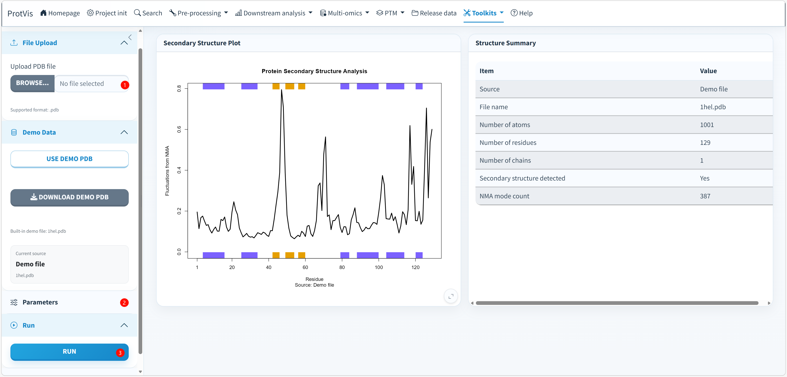

## Purpose

Use **Toolkits → Protein Structure** to analyze a protein structure from a `.pdb` file with ProtVis's current `bio3d` workflow. The module reads the PDB structure, performs **Normal Mode Analysis (NMA)**, plots residue-level fluctuations, overlays alpha-helix and beta-sheet annotations, and summarizes the loaded structure.

This module is different from **Toolkits → SwissModel**. SwissModel is used to generate or retrieve a predicted structure from a protein sequence; **Protein Structure** starts from an existing PDB file and performs structural fluctuation analysis.

## Protein Structure interface

The screenshot below shows the current Protein Structure interface. The left sidebar contains **File Upload**, **Demo Data**, **Parameters**, **Run**, and **Download** controls. The main area contains the **Secondary Structure Plot** and **Structure Summary** panels.

{#fig-protein-structure-interface fig-alt="Screenshot of ProtVis Toolkits Protein Structure. A PDB structure can be uploaded or the built-in 1hel.pdb demo can be used. Parameters control beta-sheet color, alpha-helix color and line width. The result area displays a Normal Mode Analysis fluctuation plot with secondary-structure annotation and a structure summary table." width="100%" fig-align="center"}

## Recommended operating order

**1. Load a PDB structure.** Under **File Upload**, upload a `.pdb` file. ProtVis validates the extension before accepting the file. Alternatively, open **Demo Data** and click **Use Demo PDB** to load the bundled `1hel.pdb` example.

**2. Confirm the active source.** The Demo Data panel reports the current source and active file name. When the built-in example is selected, ProtVis immediately triggers the same analysis workflow used by the **Run** button.

**3. Adjust the display parameters.** Under **Parameters**, set **Beta sheet color**, **Alpha helix color**, and **Line width**. The current defaults use an orange beta-sheet color, a purple alpha-helix color, and a line width of `2.5`.

**4. Run the analysis.** Click **Run** for an uploaded PDB file. If no file has been explicitly selected, the current implementation can fall back to the bundled demo PDB when it is available.

**5. Inspect the Secondary Structure Plot.** ProtVis reads the PDB with `bio3d::read.pdb()`, calculates normal modes with `bio3d::nma()`, and plots `modes$fluctuations` using `bio3d::plot.bio3d()`. The x-axis represents residue position and the y-axis represents **Fluctuations from NMA**. Secondary-structure information from the PDB is overlaid so helices and sheets can be interpreted together with the fluctuation profile.

**6. Inspect the Structure Summary.** The summary panel reports structural information derived from the parsed PDB, including structure size and available secondary-structure information. Use this panel to confirm that the intended structure was analyzed before interpreting the fluctuation plot.

**7. Export the figure.** Under **Download**, set plot width, height, units, resolution, and file format. ProtVis currently supports **PDF, PNG, JPEG, TIFF, and SVG**. PDF and SVG are vector outputs; PNG, JPEG, and TIFF use the selected DPI.

## What the plot represents

Normal Mode Analysis approximates collective motions that are accessible around the current protein conformation. In the ProtVis plot, larger residue-level fluctuation values indicate regions predicted to participate more strongly in these low-frequency motions, whereas lower values indicate comparatively constrained regions.

The secondary-structure overlay helps distinguish whether flexible or constrained regions correspond to alpha helices, beta sheets, or less structured segments. These patterns are useful for structural interpretation of domains, loops, mutation sites, PTMs, or candidate functional regions.

## Current ProtVis implementation

The core calculation follows the standard `bio3d` workflow:

```r
pdb <- bio3d::read.pdb(pdb_file)
modes <- bio3d::nma(pdb)

bio3d::plot.bio3d(
  modes$fluctuations,
  sse = pdb,
  sheet.col = sheet_color,
  helix.col = helix_color,
  typ = "l",
  lwd = line_width,
  xlab = "Residue",
  ylab = "Fluctuations from NMA"
)
```

This means the plotted line is the NMA fluctuation profile itself rather than a generic abundance or confidence score.

## Input requirements

The uploaded file must be a valid protein `.pdb` file that can be parsed by `bio3d` and contains the structural atoms required for NMA. If the structure lacks suitable protein C-alpha atoms or cannot be processed by the normal-mode calculation, ProtVis reports an analysis failure rather than producing a misleading plot.

::: {.callout-tip}
Use the bundled `1hel.pdb` example first when checking a new installation. If the demo works but an uploaded structure fails, the issue is more likely to be the PDB content than the Protein Structure module itself.
:::

::: {.callout-warning}
Normal Mode Analysis is a model of collective structural motions, not a direct experimental measurement of residue dynamics. Interpret NMA together with the structure source, model quality, experimental evidence, domains, interfaces, and known functional sites.
:::
