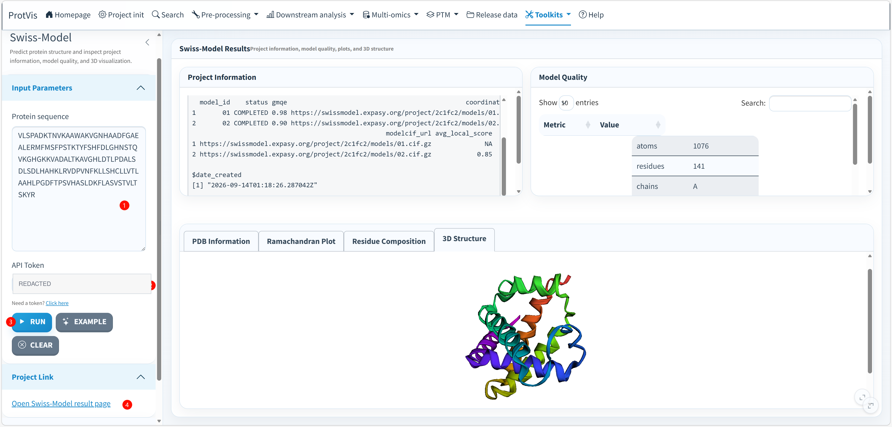

## Purpose

The **Protein Structure** toolkit connects a protein sequence to a Swiss-Model prediction workflow and then brings the returned structural information back into ProtVis for inspection. The current implementation combines Swiss-Model project information with `bio3d`-based structure parsing and `r3dmol` visualization.

## Swiss-Model interface

The screenshot below shows a completed Swiss-Model run using the built-in example protein sequence. ProtVis displays the project information and model-quality table at the top, while the lower result tabs provide **PDB Information**, **Ramachandran Plot**, **Residue Composition**, and an interactive **3D Structure** view.

{#fig-swissmodel-interface fig-cap="ProtVis Swiss-Model interface. A protein sequence is submitted to Swiss-Model, and ProtVis collects project information, model-quality metrics and structural outputs for downstream inspection. The API-token value is redacted in this documentation screenshot." width=100%}

::: {.callout-important}
Treat the Swiss-Model API token as a credential. Do not publish it in screenshots, manuscripts, repositories or shared project files. The token field in the figure above is intentionally redacted.
:::

## Input and run

Enter a protein sequence in the **Protein sequence** field and provide a valid Swiss-Model API token. ProtVis includes an **Example** button that restores the bundled demonstration sequence, a **Clear** button that clears inputs and results, and a **Run** button that starts the prediction workflow.

When **Run** is clicked, ProtVis removes whitespace from the sequence, validates that both a sequence and API token are present, configures the Swiss-Model token, and submits the sequence through the automated modeling workflow. After Swiss-Model returns the project, ProtVis reads the downloaded structure, parses the project information and calculates model-quality summaries for display.

## Results

The main result area is organized into several complementary views:

- **Project Information** reports the returned Swiss-Model project metadata and model records.
- **Model Quality** presents calculated quality metrics in a searchable table.
- **PDB Information** summarizes the parsed structure.
- **Ramachandran Plot** provides a backbone-conformation diagnostic.
- **Residue Composition** summarizes residue composition in the returned model.
- **3D Structure** opens an interactive `r3dmol` representation of the predicted structure.

Once a project has completed, **Project Link** provides a direct link to the corresponding Swiss-Model result page.

## Download outputs

ProtVis can export three structure-related outputs from this module: `swissmodel_project_info.json`, `swissmodel_model.pdb`, and `swissmodel_model_quality.csv`. Keep these files together when the predicted structure is used in a figure, candidate-gene interpretation or downstream mutation/PTM mapping so the model can be traced back to its project and quality assessment.

## Recommended workflow

1. Confirm the protein sequence and species/source before modeling.
2. Submit the sequence with a private Swiss-Model API token.
3. Review the returned project and model-quality metrics before interpreting the structure.
4. Inspect PDB information, Ramachandran distribution, residue composition and the 3D model.
5. Record the Swiss-Model project/model identifier and export the project information, structure file and quality table.
6. When mapping mutations, PTMs or domains, verify chain and residue numbering against the downloaded structure.

::: {.callout-warning}
Predicted structures and experimentally determined structures are not equivalent evidence. Report the model source and relevant quality/confidence metrics, and avoid strong mechanistic claims for poorly supported regions without additional evidence.
:::
