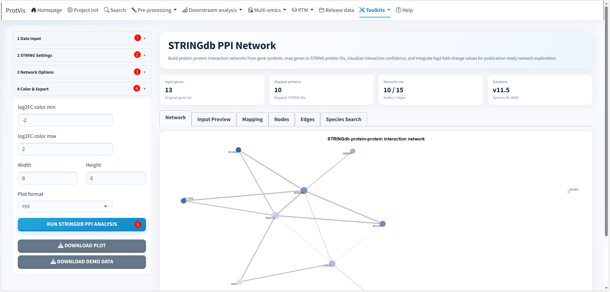

## Purpose

The **STRINGdb PPI** toolkit converts a biologically motivated candidate-gene list into a STRING protein-protein interaction network. It can be used after DEP analysis, enrichment, WGCNA, PTM analysis or any other workflow that produces a focused gene/protein set.

## STRINGdb PPI interface

The screenshot below shows the current STRINGdb PPI interface with demonstration data. The left sidebar is organized as a four-step workflow—**Data Input**, **STRING Settings**, **Network Options**, and **Color & Export**—while the main area summarizes mapping and network size and provides tabs for the network and the underlying data tables.

{#fig-stringdb-ppi-interface fig-cap="ProtVis STRINGdb PPI interface. The example shows a human demonstration dataset, STRING mapping summary, network visualization and access to the input, mapping, node, edge and species-search tables." width=100%}

The counts and interaction pattern visible in the screenshot belong only to the bundled demonstration dataset; your network size will depend on the submitted identifiers, species, STRING version and confidence threshold.

## 1. Data Input

ProtVis supports three input modes:

- **Demo data** loads the bundled example gene table.
- **Upload file** accepts CSV, TSV or text files.
- **Paste genes** accepts a pasted gene list or table.

A gene-symbol column is required for mapping. A quantitative column such as `log2FC` is optional but useful because ProtVis can use it to color network nodes. After data are loaded, the module exposes column controls so the correct gene and fold-change columns can be selected.

## 2. STRING Settings

Choose the STRING database version, species and confidence threshold before running the network analysis. The current interface provides STRING **11.5** and **12.0**, with 11.5 selected by default.

Common organism presets include human, mouse, rat, Arabidopsis, rice, maize, soybean, tomato, *Setaria viridis*, yeast, fruit fly, *C. elegans* and *E. coli* K12. A **Custom taxonomy ID** option is also available when the target species is not in the preset list. The default interaction confidence threshold is **400**, and an optional STRING cache directory can be supplied.

::: {.callout-important}
Always verify the selected species before interpreting the network. A valid gene symbol can map to different proteins—or fail to map entirely—when the wrong taxonomy ID is used.
:::

## 3. Network Options

The network can be restricted to input proteins or allowed to include additional STRING-connected proteins depending on the **Keep input proteins only** setting. The **Keep disconnected mapped proteins** option allows successfully mapped candidates to remain visible even when they have no retained interaction edge.

Available layouts include **Fruchterman-Reingold**, **Kamada-Kawai**, **Circle**, and **Stress**. Node size can be scaled by degree or held at a user-defined default size, and label size can also be adjusted.

## 4. Color and export

If a fold-change column is available, node color can represent the selected log2 fold-change range. The default color scale spans **-2 to 2**. Plot width and height are configurable, and the network can currently be downloaded as **PDF** or **PNG**.

The sidebar also provides **Download Demo Data**, which is useful for learning the expected input structure before preparing a custom dataset.

## Result tabs

After running the analysis, ProtVis organizes the output into several tabs:

- **Network** — publication-oriented PPI visualization.
- **Input Preview** — the table actually used for mapping.
- **Mapping** — input identifiers and their mapped STRING protein IDs, with a downloadable mapping table.
- **Nodes** — node-level information including gene symbol, optional log2FC and degree.
- **Edges** — STRING interaction records and combined confidence scores.
- **Species Search** — search supported STRING organisms and retrieve taxonomy IDs for custom species settings.

The summary cards above the tabs report the number of input genes, successfully mapped proteins, network size, STRING version and species ID, making it easier to identify mapping losses before interpreting the network.

## Recommended workflow

1. Prepare a clean gene/protein list and, when available, a quantitative column such as `log2FC`.
2. Confirm the correct species/taxonomy ID and STRING version.
3. Set an interaction-confidence threshold appropriate for the exploratory or publication context.
4. Run the analysis and inspect the mapping table before interpreting the network.
5. Review disconnected mapped proteins rather than silently treating them as failed candidates.
6. Adjust the network layout, labels and node scaling for readability.
7. Export the figure together with the mapping, node and edge tables used to generate it.

## Interpretation

STRING integrates evidence from multiple channels, including known and predicted associations. A STRING edge therefore does **not** necessarily mean direct physical binding in the biological system used in your experiment. Use the network to organize hypotheses and prioritize candidates, then support important interactions with literature, orthogonal databases or experimental validation.
