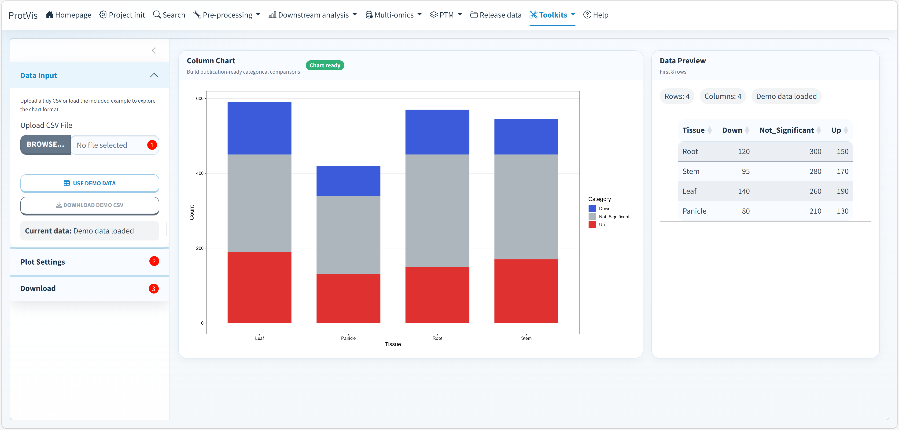

## Purpose

Use **Toolkits → Stacked Column Diagram** to compare category composition across tissues, samples, treatments, or other groups. The current ProtVis module supports three display modes from the same input table: **Stacked columns**, **Grouped columns**, and **100% stacked columns**.

This module is useful for summaries such as up/down/not-significant counts, functional-category composition, pathway classes, taxonomic composition, or any other set of numeric categories that should be compared across groups.

## Stacked Column Diagram interface

The screenshot below shows the current ProtVis interface. The left sidebar contains **Data Input**, **Plot Settings**, and **Download** controls. The main area contains the generated **Column Chart** and a **Data Preview** panel showing the first eight rows of the current dataset.

{#fig-stacked-column-interface fig-alt="Screenshot of ProtVis Toolkits Stacked Column Diagram. The left sidebar provides CSV upload or demo data, chart type, coordinate flip, bar border, axis labels, legend title, font size, category colors, run controls and export settings. The main area displays the column chart and the first rows of the dataset." width="100%" fig-align="center"}

## Recommended operating order

**1. Load the data.** Under **Data Input**, either upload a tidy `.csv` file with **Upload CSV File** or click **USE DEMO DATA**. ProtVis also provides **DOWNLOAD DEMO CSV** so the required input structure can be reused as a template.

**2. Confirm the input structure.** The current implementation requires a column named exactly `Tissue`. Every other column intended for plotting must be numeric. After loading data, the status box reports the current data source and the **Data Preview** card shows the first eight rows together with row and column counts.

**3. Choose the chart type.** Under **Plot Settings**, select one of the three supported modes:

- **Stacked columns** — category values are stacked and retain their original magnitude.
- **Grouped columns** — categories are displayed side by side within each tissue/group.
- **100% stacked columns** — each column is normalized to the same total height, emphasizing relative composition rather than absolute totals.

**4. Adjust the layout.** Enable **Flip Coordinates** when horizontal bars are easier to read. Enable **Show Bar Border** to draw a black border around each bar segment.

**5. Edit labels and typography.** Set **X-Axis Label**, **Y-Axis Label**, **Legend Title**, and **Base Font Size**. The current defaults are `Tissue`, `Count`, `Category`, and a base font size of `12`.

**6. Set category colors.** Once valid data has been loaded, ProtVis creates one color selector for each numeric category column. The category order follows the numeric-column order in the input table, so arrange columns deliberately when a particular legend/stack order is required.

**7. Generate the chart.** Click **RUN CHART**. Before the first run, the main panel reports **Ready to run**; after successful plotting, the status changes to **Chart ready** and the download button becomes available.

**8. Inspect the preview and biological pattern.** Check that totals, group order, category order, and relative proportions match the source table. For 100% stacked columns, focus on composition rather than absolute abundance because each group is normalized independently.

**9. Export the figure.** Under **Download**, choose **PDF**, **PNG**, **JPG**, or **SVG**, set width and height in inches, and set DPI for PNG/JPG output. The current defaults are 8 × 6 inches and 300 DPI.

## Input format

The first column must be named `Tissue`; the remaining plotting columns must be numeric. For example:

```text
Tissue,Down,Not_Significant,Up
Root,120,300,150
Stem,95,280,170
Leaf,140,260,190
Panicle,80,210,130
```

This is also the structure used by the built-in demonstration dataset.

## How ProtVis constructs the plot

ProtVis keeps `Tissue` as the grouping variable and converts the remaining numeric category columns from wide format to long format. It then draws the categories with `ggplot2::geom_bar(stat = "identity")`. The selected chart type determines the position mode: `stack`, `dodge`, or `fill`.

For **100% stacked columns**, the plotting layer uses the `fill` position, so each tissue/group is scaled to the same total height. The underlying numeric values are not replaced in the uploaded dataset; normalization is performed for visualization.

## Choosing the right display

Use **Stacked columns** when both total magnitude and composition matter. Use **Grouped columns** when direct category-by-category comparisons are more important than the total. Use **100% stacked columns** when comparing relative composition among groups with very different totals.

::: {.callout-tip}
If the legend or stack order is biologically important, arrange the numeric category columns in the desired order before upload. ProtVis preserves that column order when constructing the category factor.
:::

::: {.callout-warning}
The module currently requires the grouping column to be named exactly `Tissue`. A differently named first column will not be recognized automatically. Rename the grouping column before upload if necessary.
:::
