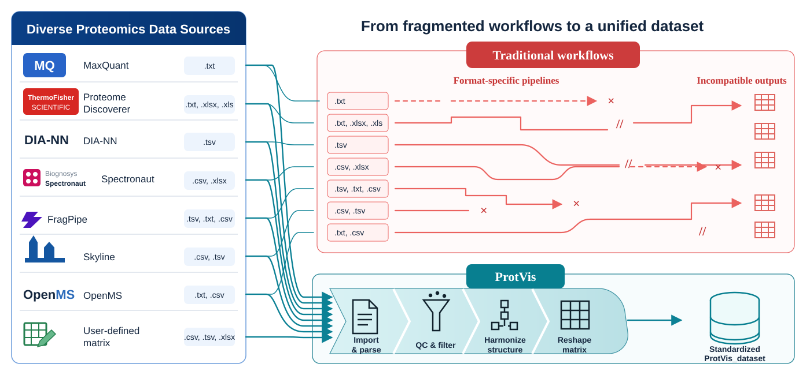

## Purpose

The **Data input** page is selected dynamically from the source chosen during Project init. Its job is to load the source-specific quantitative evidence, remove unreliable entries where appropriate, and hand a clean expression matrix to preprocessing.

ProtVis currently routes the following source types to dedicated or parser-backed modules: **Raw, MaxQuant, Proteome Discoverer, DIA-NN, Spectronaut, FragPipe, Skyline, Mascot, OpenMS, and User-defined matrix**.

The figure below summarizes the central design of ProtVis. Representative source-specific exports remain heterogeneous at ingestion, while ProtVis brings them through a shared sequence of import and parsing, QC and filtering, structure harmonization, and matrix reshaping to produce a standardized `ProtVis_dataset`.

{#fig-protvis-data-input-workflow fig-alt="Representative proteomics data sources and file formats feed either fragmented source-specific pipelines or the unified ProtVis workflow. ProtVis performs import and parsing, QC and filtering, structure harmonization, and matrix reshaping to produce a standardized ProtVis_dataset." width="100%" fig-align="center"}

## Recommended workflow

1. Complete **Project init** first.
2. Open **Data input** and confirm that the header shows the expected source.
3. Load the corresponding search-engine/export file if the selected source requires one.
4. Review the raw/source preview before filtering.
5. Apply the source-specific unreliable-evidence filtering controls.
6. Confirm that the output retains a protein identifier and the expected samples.
7. Continue to **Pre-processing → Correct Noise**.

## Source-specific behavior

Different proteomics tools use different column names and evidence flags. ProtVis therefore avoids forcing every source through a MaxQuant-only parser. Parser-backed sources are converted into a common protein-by-sample representation before they enter the shared workflow.

For MaxQuant-style inputs, common unreliable records include reverse hits, contaminants, and entries flagged as identified only by site. Other sources use their own available evidence fields.

::: {.callout-warning}
## Do not treat zeros or sentinel values as biological abundance
Missing or not-observed measurements must remain missing until the explicit imputation stage. In the current workflow, values such as `0` and the legacy `-8` sentinel are converted to `NA` before imputation where applicable.
:::

## Built-in source fixtures

ProtVis ships small examples for several input ecosystems, including MaxQuant, Proteome Discoverer, DIA-NN, Spectronaut, FragPipe, Skyline, OpenMS, and mzTab-oriented data. These fixtures are useful for verifying that a parser is operational.

A programmatic example is:

```r
library(ProtVis)

example_data <- load_protvis_builtin_data(
  source = "DIA-NN",
  auto_export = FALSE
)

example_data
```

## Output and compatibility

Current modules update the canonical `ProtVis_dataset`. The GUI also maintains stage snapshots used by downstream compatibility paths. **Correct Noise** can recover the imported stage from `Step2_remove_unreliable_peptide.rda` when an in-memory `ProtVis_dataset` is not available.

The preferred workflow is to keep the active `ProtVis_dataset` intact rather than manually opening, modifying, and resaving stage `.rda` files.
