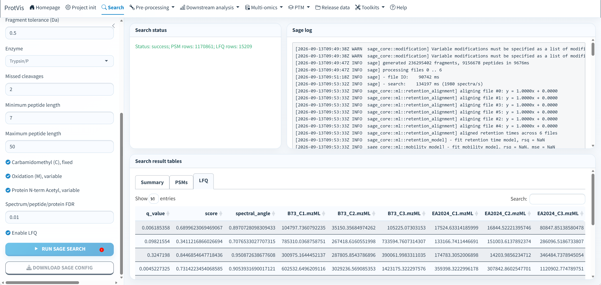

## When to use Sage

Use **Search → Sage** for a lightweight Raw-project database search from **mzML + protein FASTA**. Sage is bundled with ProtVis on Windows, Linux, Apple Silicon macOS and Intel macOS.

The route is:

**Project init → Search → Sage → Project Dashboard → Pre-processing**

## Prerequisites

Complete the Raw route in Project init first:

1. set a writable working directory;
2. load sample information with `sample_id` and `mzml_file`;
3. upload the protein FASTA;
4. select the mzML directory;
5. click **Check LC-MS files**;
6. select **Raw**;
7. run **Project init**.

::: {.callout-important}
A Sage project does not need a protein expression matrix before Search. The staging object is intentionally matrix-free until LFQ is produced.
:::

## Example dataset: PXD065315

The bundled template uses six maize control samples from public PRIDE project **PXD065315**: `B73_C1`–`B73_C3` and `EA2024_C1`–`EA2024_C3`.

- [PRIDE project](https://www.ebi.ac.uk/pride/archive/projects/PXD065315)
- [ProteomeXchange](https://proteomecentral.proteomexchange.org/?pxid=PXD065315)

The PRIDE deposit contains vendor `.raw` files. The Sage tutorial uses locally converted `.mzML` files with matching names such as `B73_C1.mzML`. See the [RAW → mzML](msconvert_raw_to_mzml.qmd) tutorials.

## Bundled Sage executable

ProtVis resolves Sage in this order: an explicitly supplied path, the platform-specific bundled binary, then `sage`/`sage.exe` on `PATH`.

| Platform | Bundled binary |
|---|---|
| Windows | `inst/extdata/sage/windows/sage.exe` |
| Linux | `inst/extdata/sage/Linux/sage` |
| macOS Apple Silicon | `inst/extdata/sage/macOS/ARM64/sage` |
| macOS Intel | `inst/extdata/sage/macOS/Intel/sage` |

```r
ProtVis::protvis_sage_executable()
```

On Unix-like systems ProtVis also attempts to restore the executable bit if packaging/transfer removed it.

## Search parameters

The Sage panel exposes the search tolerances, enzyme/missed cleavages, peptide length, fixed/variable modifications, FDR and LFQ settings. Review them for the experiment rather than treating the demo defaults as universal.

Common defaults in the current workflow include 20 ppm precursor tolerance, 0.5 Da fragment tolerance, Trypsin/P, two missed cleavages, peptide length 7–50, fixed Carbamidomethyl(C), variable Oxidation(M), protein N-term acetylation, 1% FDR and LFQ enabled.

## Run Sage

{#fig-sage-search-gui fig-alt="ProtVis Search Sage tab with search controls, status/log and Summary, PSMs and LFQ result tables." width="100%" fig-align="center"}

Click **Run Sage Search** once and follow the log. Duplicate-run protection prevents the same long-running action from being launched repeatedly.

After success, inspect:

- **Summary** for search-level counts;
- **PSMs** for peptide-spectrum matches;
- **LFQ** for the quantitative table used to create the protein matrix.

The row counts shown in the screenshot are example-specific, not QC thresholds.

## Produced files

```text
Sage_search/
├── sage_config.json
├── results.sage.tsv
├── lfq.tsv
└── results.json
```

Use **Download Sage Config** to keep an independent copy of the generated configuration.

## How Sage becomes ProtVis_dataset

ProtVis maps LFQ columns back to registered sample IDs, removes `rev_` decoys, aggregates target protein intensities, retains the PSM assay and finalizes the staging object into the canonical protein-by-sample project.

Search configuration, paths, result tables, files, log and provenance are stored in the project. Existing output files are fingerprinted for reproducibility.

Compatibility checkpoints such as `Step2_sage_database_search.rda` and the cross-source Step2 handoff can still be written, but schema-v4 run history is the canonical analytical record.

## Search QC and recovery

After search, open [Project Dashboard](../reproducibility/Project_Dashboard.qmd). Sage QC can summarize run-level IDs, precursor charge, mass error, q-values, peptide length, missed cleavages and retention time.

If the Shiny session restarts, ProtVis can recover a completed Sage search when the project directory, Sage results, FASTA and mzML context remain available. Keep the complete project directory together rather than moving only `lfq.tsv`.

## Troubleshooting

**Search is hidden.** Select Raw in Project init.

**Sage is not found.** Reinstall the current package and check `protvis_sage_executable()`; all four supported platform binaries are now bundled.

**LFQ does not map to samples.** Check `sample_info$mzml_file` against actual mzML filenames.

**Pre-processing cannot load a matrix.** The project is probably still in search staging; complete Sage successfully first.
