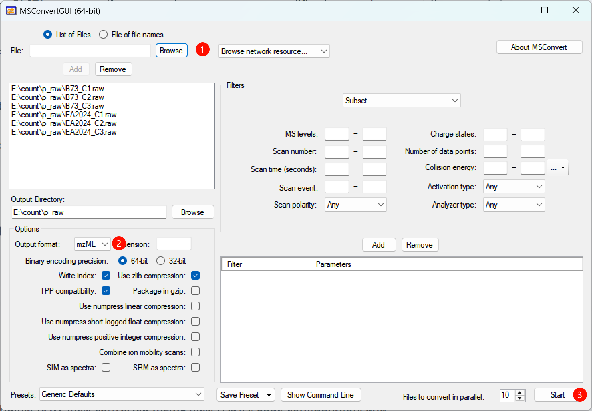

## Recommended Windows route

On Windows, use **ProteoWizard MSConvert** for direct conversion of supported vendor RAW files to mzML. This is the preferred route for the Thermo `.raw` files used by the ProtVis PXD065315 example because ProteoWizard can use the Windows vendor readers required for direct RAW access.

The route is:

**Vendor RAW → MSConvertGUI / msconvert.exe → mzML → ProtVis Project init → Sage Search → ProtVis_dataset**

## Download ProteoWizard / MSConvert

Use the official ProteoWizard resources:

- [ProteoWizard download page](https://proteowizard.sourceforge.io/download.html)
- [ProteoWizard user documentation](https://proteowizard.sourceforge.io/doc_users.html)
- [MSConvert documentation](https://proteowizard.sourceforge.io/tools/msconvert.html)

Download the current **64-bit Windows installer** unless your computer specifically requires another build. Record the ProteoWizard version used for conversion because conversion software is part of the analysis provenance.

## Install on Windows

Run the installer and keep the standard MSConvert components. The current ProteoWizard Windows installer documentation requires **Microsoft .NET Framework 4.7.2 or newer**.

After installation, you should have:

- **MSConvertGUI** for graphical conversion;
- **msconvert.exe** for command-line conversion;
- **SeeMS** for inspecting open-format spectra.

A typical installation is inside a versioned directory under:

```text
C:\Program Files\ProteoWizard\
```

The exact subdirectory depends on the installed build.

### Verify the installation

Open PowerShell or Command Prompt and run:

```powershell
msconvert.exe --help
```

If the command is not found, either run `msconvert.exe` using its full path or add the ProteoWizard installation directory to `PATH`.

## Convert with MSConvertGUI

The annotated screenshot below shows the six PXD065315 control RAW files. The three red markers indicate the core workflow: **1** choose the RAW files, **2** select `mzML`, and **3** start conversion.

{#fig-msconvert-windows fig-alt="Annotated screenshot of MSConvertGUI with six Thermo RAW files loaded. Marker 1 indicates selecting RAW files, marker 2 highlights mzML as output format, and marker 3 highlights Start." width="100%" fig-align="center"}

### 1. Add RAW files

Click **Browse** and add one or more vendor RAW files. Convert all samples in one batch whenever possible so they receive identical settings.

For the ProtVis PXD065315 control example:

```text
B73_C1.raw
B73_C2.raw
B73_C3.raw
EA2024_C1.raw
EA2024_C2.raw
EA2024_C3.raw
```

### 2. Use a separate output directory

Do not mix converted mzML files with the original RAW files. For example:

```text
E:\count\p_raw\      # original RAW
E:\count\p_mzML\     # converted mzML
```

Select `E:\count\p_mzML\` as the **Output Directory**.

### 3. Set the output format

Use:

```text
Output format: mzML
```

Leave **Package in gzip** off because ProtVis expects ordinary `.mzML` filenames in the current Raw workflow.

### 4. Keep zlib compression enabled

Recommended:

```text
Write index: enabled
Use zlib compression: enabled
Binary encoding precision: 64-bit
```

zlib reduces file size without changing the numerical spectra. Numpress options are not required for this workflow and can remain disabled unless they are part of a validated pipeline.

### 5. Decide whether Peak Picking is required

If the RAW file contains **profile-mode spectra** that should be centroided before Sage searching, add the **Peak Picking** filter. For Thermo data, use vendor peak picking when available and place Peak Picking first in the filter list.

A commonly used command-line equivalent is:

```text
peakPicking true 1-
```

This means peak picking from MS1 upward.

::: {.callout-warning}
## Do not centroid twice
If the acquisition is already centroided, do not add Peak Picking simply because the option exists. Redundant centroiding can unnecessarily alter the spectra. Confirm the acquisition mode before conversion.
:::

### 6. Choose a reasonable parallel file count

For a six-file conversion, **2–4 files in parallel** is usually a safer starting point than launching all files simultaneously. Conversion can be disk-I/O and memory intensive.

### 7. Start conversion

Click **Start** and wait until all files complete without errors. The output filename stems should remain unchanged:

```text
B73_C1.raw     → B73_C1.mzML
B73_C2.raw     → B73_C2.mzML
EA2024_C1.raw  → EA2024_C1.mzML
```

## Convert from the command line

### One file

```powershell
msconvert.exe "E:\count\p_raw\B73_C1.raw" --mzML --zlib --filter "peakPicking true 1-" -o "E:\count\p_mzML"
```

### All RAW files in a directory

```powershell
msconvert.exe "E:\count\p_raw\*.raw" --mzML --zlib --filter "peakPicking true 1-" -o "E:\count\p_mzML"
```

If the data are already centroided, omit the Peak Picking filter:

```powershell
msconvert.exe "E:\count\p_raw\*.raw" --mzML --zlib -o "E:\count\p_mzML"
```

Inspect the exact options provided by the installed build with:

```powershell
msconvert.exe --help
msconvert.exe --show-examples
```

## Verify the mzML output

Before opening ProtVis, confirm:

1. the number of `.mzML` files matches the number of RAW files;
2. each output file is non-empty and has a plausible file size;
3. the filename stems are unchanged;
4. the MSConvert log contains no conversion errors;
5. the data contain the expected MS levels, especially MS1 and MS2 for DDA proteomics;
6. every sample was converted with the same settings.

Use **SeeMS** if you need to open an mzML file and inspect spectra manually.

## PXD065315 example layout

```text
PXD065315_control/
├── raw/
│   ├── B73_C1.raw
│   ├── B73_C2.raw
│   ├── B73_C3.raw
│   ├── EA2024_C1.raw
│   ├── EA2024_C2.raw
│   └── EA2024_C3.raw
└── mzML/
    ├── B73_C1.mzML
    ├── B73_C2.mzML
    ├── B73_C3.mzML
    ├── EA2024_C1.mzML
    ├── EA2024_C2.mzML
    └── EA2024_C3.mzML
```

## Continue into ProtVis

1. Open **Project init**.
2. Select **Raw**.
3. Load/upload sample information containing `sample_id` and `mzml_file`.
4. Upload the matching protein FASTA.
5. Select the directory containing the `.mzML` files.
6. Click **Check mzML files**.
7. Resolve every missing or invalid row.
8. Click **Project init**.
9. Open **Search** and run Sage.

Continue with [Raw/mzML + Sage search](raw_sage_search.qmd).

## Troubleshooting

**MSConvert cannot read a RAW file.** Confirm that the file is complete, the correct vendor reader is available, and conversion is being performed with a current Windows ProteoWizard installation.

**The mzML files are unexpectedly huge.** Confirm that zlib compression is enabled. Profile-mode data can also be much larger than centroided data.

**Sage finds very few or no PSMs.** First verify that the mzML contains valid MS2 spectra and that centroiding was appropriate. Then check FASTA, enzyme, modifications, precursor tolerance and fragment tolerance.

**ProtVis reports files as missing.** `sample_info$mzml_file` must exactly match the converted filename, including `.mzML`.

## Reproducibility checklist

Record:

```text
Operating system: Windows
ProteoWizard/MSConvert version:
Original vendor format:
Output format: mzML
zlib compression: yes/no
Peak Picking: yes/no
Peak Picking MS levels:
Additional filters:
Conversion date:
```
