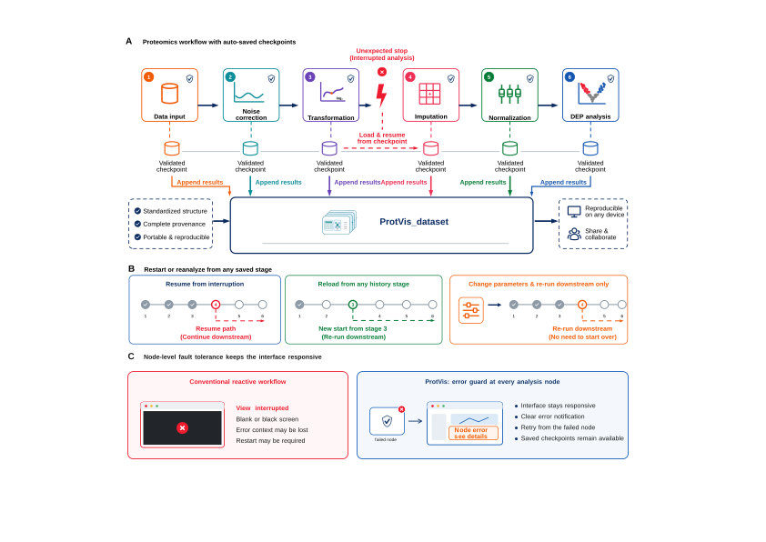

## Two complementary recovery layers

ProtVis 0.9.1 uses both **schema-v4 run history** and serialized **checkpoints/stage files**. The active `ProtVis_dataset` is authoritative; checkpoints make that state recoverable, while the append-only run registry preserves earlier executions even when they are no longer current.

{#fig-protvis-checkpoint-recovery fig-alt="Checkpoint-aware ProtVis workflow with saved project states, resume paths and node-level failure isolation." width="98%" fig-align="center"}

## Canonical checkpoint stages

The current ordered checkpoint progression is:

```text
creation → import → noise_correction → transformation → imputation →
normalization → dimensionality_reduction → differential_analysis →
enrichment → network
```

## Save and list checkpoints

```r
path <- save_protvis_checkpoint(
  dataset,
  directory = "checkpoints",
  stage = "normalization",
  keep = 20
)

list_protvis_checkpoints("checkpoints")
```

The listing reports path, stage, time, size, MD5 and readability. Checkpoints are written through a temporary file and validated before publication.

## Restore the newest valid state

```r
restored <- restore_protvis_checkpoint(
  "checkpoints",
  version = "latest"
)
```

or request a stage:

```r
restored <- restore_protvis_checkpoint(
  "checkpoints",
  stage = "differential_analysis"
)
```

If the exact stage is absent, ProtVis can select the newest readable checkpoint at or before the requested stage.

## Workflow invalidation

Schema v4 records dependency edges between runs. Re-running an upstream stage can invalidate its downstream dependants. Invalidated runs remain available in immutable history for auditability but should not be treated as current results.

Inspect the active/invalidated state in [Project Dashboard](Project_Dashboard.qmd), which exposes the run registry, workflow nodes and workflow edges.

## Resume from the GUI

Use **Project Dashboard → Resume workflow** after reopening a project. Resume is state-aware: a Raw project that has not completed search is routed back to Search rather than being allowed to enter quantitative preprocessing.

## Search recovery

### Sage

A completed Sage project can be reconstructed from the project `Sage_search` context when `lfq.tsv`, configuration, FASTA and mzML inputs remain resolvable. Keep the whole directory together:

```text
Sage_search/
├── sage_config.json
├── results.sage.tsv
├── lfq.tsv
└── results.json
```

### FragPipe

FragPipe runs preserve the prepared workflow, manifest, runtime information, log and parsed result files under the project. The search run is also indexed by schema v4; keep the official workflow/runtime context with the project when reproducibility is required.

## Compatibility stage files

Legacy/current GUI compatibility files can include:

```text
Step1_project_init.rda
Step2_remove_unreliable_peptide.rda
Step2_sage_database_search.rda
Step3_correct_noise.rda
Step4_data_transformed.rda
Step5_data_imputation.rda
Step6_data_normalization.rda
Step7_differential_analysis.rda
Step7_DEP_engines.rda
```

These files are recovery/compatibility snapshots; the schema-v4 result registry is the richer analytical history.

## Portable export

```r
export_dir <- export_protvis_dataset(
  dataset,
  directory = "ProtVis_release",
  include_raw = FALSE
)
```

A modern portable export can include the serialized dataset, matrices/metadata, annotations, process history, provenance, workflow status, result registry and per-run results/artifacts.

::: {.callout-tip}
Keep the project directory, latest portable export, checkpoints and search directories together. This preserves both restartability and the evidence needed to explain exactly which run produced a final figure.
:::
